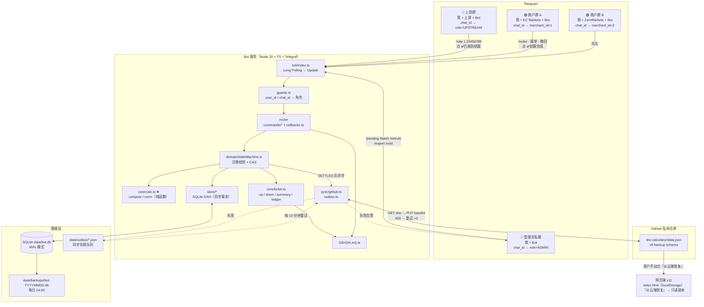
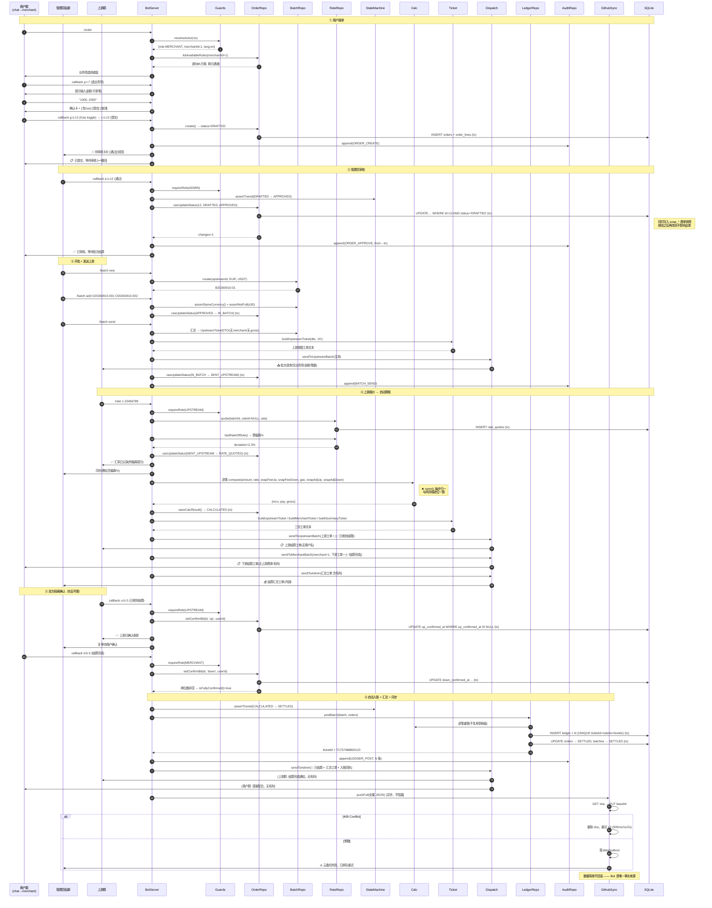
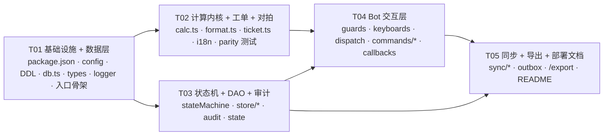

# ARCH · 费率结算 Telegram Bot 技术方案与任务分解

| 项目信息 | 内容 |
| --- | --- |
| 文档语言 | 中文 |
| 项目名称 | `fee_settlement_tgbot` |
| 版本 | v1.0（架构设计，待评审） |
| 撰写 | 高见远（架构师） |
| 上游输入 | `docs/PRD-TGBot.md`（许清楚，v0.1）+ 主理人拍板的 4 项关键决策 + 9 项次要决策 |
| 关联产品 | 费率结算自动计算器 v11（`fee-calculator/index.html`，3540 行，已核对 1500–1560 / 2580–2960 / 3247–3495 行） |
| 文档状态 | 待评审。含 14 项待明确事项（第 12 章），其中 3 项建议主理人回用户确认 |

---

## 0. 已确认决策（本方案的硬约束）

| # | 决策 | 落地影响 |
| --- | --- | --- |
| D1（Q1） | **方案 A 三会话**：上游群 / 商户群（一商户一群）/ 管理员私聊。Bot 作桥梁转发 | 会话绑定表 `chats`；消息分发必须走统一 `dispatcher`，禁止裸发 |
| D2（Q2） | 先本地 Mac Long Polling 试跑，代码按 VPS 约束写（无绝对路径、配置走环境变量），二期迁 VPS + pm2 | 路径一律 `path.join(__dirname, ...)` 或 `DATA_DIR` 环境变量 |
| D3（Q3） | **Bot 为准 + GitHub 总线（S1）**，存储 SQLite，网页端账本 = **只读副本** | Bot 单向写 `data.json`；反向只同步 `rulePresets` |
| D4（Q5） | 一商户一群，`chat_id ↔ merchant_id` 绑定，报单自动带出商户 | 报单流程无「选商户」步骤 |
| D5（Q4） | 规则网页端维护 → 同步给 Bot；Bot 侧 `/listrules`（只读）+ `/setrule`（应急，仅管理员私聊，改后写流水）；全局规则表 + 商户可见性表；**规则变更必须留费率快照** | `rules` + `merchant_rules` + `orders.snap_*` |
| D6（Q6） | 汇率 A+B 混合：`/rate <值>` 批次默认；`/rate <业务项名> <值>` 覆盖单业务项 | `rate_quotes.rule_id` 可空 |
| D7（Q7） | Token 用户自创（**必须关 Privacy Mode**），环境变量注入；本期不实现 Token 相关代码，只写配置与部署文档 | README 章节 + `.env.example` |
| D8（Q10） | MVP 手动开批（`/batch new` → 勾选 → `/batch send`），定时开批 P2 | 无 cron 依赖 |
| D9（Q16） | 允许不同商户混批；**不允许不同货币对混批**；单批 ≤ 30 笔 | `/batch add` 时校验货币对 |
| D10（Q12） | 商户仅审核前可撤回；管理员任何阶段可改但需重走审核；**CALCULATED 后禁止就地改数字**，只能整批作废重开 | 状态机迁移表 + `/void` |
| D11（Q17） | Gas Fee 报单时 toggle，默认关闭，按笔扣 1.2U，值可配置 | `app_state.gas_fee`，默认 1.2 |
| D12（Q18） | 按会话设默认语言 `/lang zh/en/ms/vi`，复用网页端 I18N 词条命名 | `src/i18n/*` |
| D13 | MVP 语言范围：**中文 + English**（马/越二期） | `zh.ts` / `en.ts` |
| D14（Q21） | 重复报单不自动拦截，审核卡片标红提示疑似重复 | 审核卡片加提示行 |

---

## 1. 技术选型与理由

### 1.1 选型总表

| 层 | 选型 | 版本 | 理由 | 被否决的备选 |
| --- | --- | --- | --- | --- |
| 运行时 | **Node.js** | 20 LTS（本地现有 22.22.2 亦可） | 见下方「决定性理由」 | Python 3.11 |
| 语言 | **TypeScript** | ^5.6 | 状态枚举、DDL 映射、callback 路由需要类型保护；用户虽是业务人员，但类型错误会在编译期挡住，反而减少线上事故 | 纯 JS |
| Bot 框架 | **Telegraf** | ^4.16 | Node 生态最成熟；middleware / session / scene / inline keyboard 齐全；`bot.launch()` 默认 Long Polling，迁 Webhook 只改一行配置 | node-telegram-bot-api（维护停滞）、grammY（生态略小） |
| 数据库 | **SQLite + better-sqlite3** | ^11.5 | 单文件、零运维、同步 API（**Node 单线程下无 await 竞态**）、`db.transaction()` 天然串行；prebuilt 二进制覆盖 macOS arm64/x64 与 Linux x64，无需本地编译 | `node:sqlite`（Node 22 仍为 experimental，API 不稳定）；PostgreSQL（过度设计）；JSON 文件（并发写丢数据） |
| GitHub 同步 | **@octokit/rest** | ^21.0 | 官方 SDK，与网页端 `fetch('https://api.github.com' + path)` 语义一致，便于逐字段对齐 | 裸 fetch（要自己处理 409/限流） |
| 配置 | **dotenv + zod** | dotenv ^16.4 / zod ^3.23 | 环境变量集中校验，缺失即启动失败并给出人话提示（用户是业务人员，不能让他看 `undefined` 崩溃） | 手写 `process.env.X!` |
| 运行方式 | **tsx**（本地）+ **pm2**（VPS） | tsx ^4.19 / pm2 ^5.4 | 本地 `npm run dev` = `tsx watch`，**零构建步骤**；VPS 上 `npm run build` → `pm2 start dist/index.js` | ts-node（慢）、pkg 打包（体积大） |
| 测试 | **Vitest** + **puppeteer-core** | vitest ^2.1 / puppeteer-core ^25.10 | Vitest 与 TS 零配置；puppeteer-core 复用 `.qa` 既有测试基建（同一 Chrome 路径、同一 `file://` 页面）做**跨端对拍** | Jest（TS 配置繁琐） |
| 日志 | 自研 `src/util/logger.ts` | — | 按天轮转 + 控制台双写；不引第三方（需求只有 30 行） | winston / pino |

> **争议点回应：为什么不用 Python + python-telegram-bot？**
> 本项目的**头号风险**是「Bot 与网页端算出的数字不一致」（PRD 第 9 章明确列为风险）。网页端计算内核是 JavaScript，其精度语义完全依赖 `Number.prototype.toFixed` + IEEE754 double：
> ```js
> function norm(n) { return Number(n.toFixed(8)); }   // index.html:1552
> ```
> 用 Node 可以把 `compute()` / `norm()` **逐字复制**过去，逐位一致是**结构性保证**；用 Python 则要把 `toFixed(8)` 的舍入语义（JS 用 round-half-away-from-zero 的十进制最短表示再截断，Python 的 `round()` 是银行家舍入）逐一验证，任何一处偏差都会造成真金白银的错账。
> **结论：Node。这一条不妥协。**

### 1.2 依赖清单（Required Packages）

```
# 运行时
telegraf@^4.16.3            : Telegram Bot 框架（Long Polling / Webhook / inline keyboard）
better-sqlite3@^11.5.0      : SQLite 同步驱动（事务 + WAL）
@octokit/rest@^21.0.2       : GitHub Contents API 读写（云同步总线）
dotenv@^16.4.5              : .env 加载
zod@^3.23.8                 : 环境变量与入参校验

# 开发时
typescript@^5.6.3           : 类型系统
tsx@^4.19.2                 : 本地直接跑 TS（dev / 二期 pm2 也可用）
@types/node@^22.9.0
@types/better-sqlite3@^7.6.11
vitest@^2.1.4               : 单元测试 + 对拍测试
puppeteer-core@^25.10.0     : 对拍测试驱动无头 Chrome 加载网页端 index.html
```

---

## 2. 系统架构图



**信息隔离硬约束（对应 PRD §2.3）**

| 目标会话 | 允许出现 | 严禁出现 |
| --- | --- | --- |
| 上游群 | 业务项名 / 汇率 / 上游费率 / 单价 / 费后汇率 / 明细实收 / 小计 / 总计 / 笔数 | ❌ 商户名 ❌ 我方抬头 ❌ 下游费率 ❌ 毛利 |
| 商户群（单商户） | 该商户自己的业务项 / 汇率 / 下游费率 / 费后汇率 / 明细实付 / 小计 / 总计 | ❌ 上游费率 ❌ 毛利 ❌ 其他商户 ❌ 我方抬头 |
| 管理员私聊 | 全部（含汇总工单 + 毛利） | — |

> 实现保障：所有出站消息**必须**经 `bot/dispatch.ts` 的 `sendToUpstreamBatch()` / `sendToMerchantBatch()` / `sendToAdmin()` 三个函数，函数内部接收的是**已裁剪的 DTO**（`UpstreamTicketDTO` 里根本没有 `merchant` 和 `gross` 字段），从类型层面杜绝泄露。禁止在 handler 里直接调 `ctx.telegram.sendMessage`。

---

## 3. 模块划分与文件列表

```
fee-settlement-tgbot/
├── package.json                    # 依赖 + scripts（dev/build/start/migrate/test）
├── tsconfig.json                   # target ES2022, strict, moduleResolution bundler
├── .env.example                    # ★ 全部配置项 + 中文注释（含 BotFather 关 Privacy Mode 说明）
├── .gitignore                      # node_modules/ data/ logs/ .env
├── README.md                       # 5 分钟跑起来 + BotFather  checklist + 二期迁 VPS
├── data/                           # 【gitignore】运行期产物
│   ├── bot.db  bot.db-wal  bot.db-shm
│   ├── backups/bot-YYYYMMDD.db
│   └── outbox/<ts>.json            # GitHub 同步失败队列
├── logs/                           # 【gitignore】bot-YYYY-MM-DD.log（保留 30 天）
├── migrations/
│   └── 001_init.sql                # 全量 DDL（第 4 章）
├── src/
│   ├── index.ts                    # 入口：config → migrate → 注册 bot → launch → 优雅退出
│   ├── config.ts                   # zod 校验环境变量 → 冻结的 Config 对象
│   ├── core/                       # ★ 纯函数区，零 IO、零 DB、零 Telegram 依赖
│   │   ├── calc.ts                 # GAS_FEE / norm / compute / computeRuleTotals（逐字移植）
│   │   ├── format.ts               # fmtNum / fmtMoney / fmtRate / fmtRateExt / fmtDateTime / fmtSigned
│   │   ├── ticket.ts               # tkN/tkAmt/tkRate/tkRateExt/tkFee/tkAdj + 4 个 build*Ticket
│   │   └── dto.ts                  # UpstreamTicketDTO / MerchantTicketDTO / SummaryTicketDTO（裁剪后入参）
│   ├── domain/                     # 业务规则，不碰 IO
│   │   ├── types.ts                # 全部枚举常量 + 接口定义
│   │   ├── stateMachine.ts         # 迁移表 + canTransit() + assertTransit()
│   │   ├── ids.ts                  # newOrderNo / newBatchNo / newTicketId / newLedgerId
│   │   └── errors.ts               # AppError{code, i18nKey, detail}
│   ├── store/                      # SQLite DAO，better-sqlite3 同步 API
│   │   ├── db.ts                   # 连接 + PRAGMA + migrate() + tx() 包装
│   │   ├── chats.ts                # 会话绑定 / 角色解析
│   │   ├── merchants.ts            # 商户 CRUD + /bind
│   │   ├── rules.ts                # 规则库 + 商户可见性 + 快照取值
│   │   ├── orders.ts               # 报单 + order_lines + 双确认位
│   │   ├── batches.ts              # 批次 + 货币对校验 + 计数
│   │   ├── rates.ts                # rate_quotes 写入 / 取生效值 / 偏离计算
│   │   ├── ledger.ts               # 入账（同 ticketId 批量写）+ 查询
│   │   ├── audit.ts                # audit_log 追加（只增不改不删）
│   │   └── state.ts                # app_state KV + 日序号 + 幂等表
│   ├── bot/
│   │   ├── index.ts                # Telegraf 实例、全局 middleware、错误兜底
│   │   ├── session.ts              # 内存会话态（报单向导 / 驳回原因输入 / 代录）
│   │   ├── guards.ts               # resolveActor(ctx) → {userId, role, merchantId, chatId, lang}
│   │   ├── keyboards.ts            # inline keyboard 构造 + callback_data encode/decode
│   │   ├── dispatch.ts             # ★ 三个出站函数（隔离裁剪）
│   │   ├── callbacks.ts            # callback 路由表
│   │   └── commands/
│   │       ├── common.ts           # /start /help /whoami
│   │       ├── merchant.ts         # /order /myorders（P2）
│   │       ├── upstream.ts         # /rate
│   │       └── admin.ts            # /pending /batch /cancelbatch /void /listrules
│   │                               # /setrule /importrules /export /lang /bind /sync /purge
│   ├── sync/
│   │   ├── schema.ts               # v9 backup JSON 的类型 + Bot ↔ JSON 双向映射
│   │   ├── github.ts               # @octokit/rest：GET sha → PUT base64 → 409 重试
│   │   └── outbox.ts               # 失败落盘 + 定时重投
│   ├── i18n/
│   │   ├── index.ts                # t(key) / tf(key, args) / pickLang(chat)
│   │   ├── zh.ts                   # 复用网页端 I18N zh 词条 + bot.* 新增
│   │   └── en.ts                   # 复用网页端 I18N en 词条 + bot.* 新增
│   └── util/
│       ├── logger.ts               # 按天轮转 + 级别
│       └── time.ts                 # now() / dayKey() / fmtDateTime（TZ 可配）
└── tests/
    ├── calc.spec.ts                # 计算内核单元（含边界）
    ├── ticket.spec.ts              # 工单文本快照（zh / en）
    ├── stateMachine.spec.ts        # 全迁移矩阵
    ├── store.spec.ts               # DAO + 事务 + 幂等
    ├── parity.spec.ts              # ★ 跨端对拍（puppeteer 跑网页端）
    └── fixtures/
        ├── vectors.json            # 对拍向量（从 .qa 抽取 + fuzz）
        └── compute_reference.js    # ★ 从 index.html 冻结的 compute 源码，用于源码级对拍
```

---

## 4. 数据模型（SQLite DDL）

### 4.1 全局约束（写在 `migrations/001_init.sql` 开头）

```sql
PRAGMA journal_mode = WAL;      -- 读写并发，掉电安全
PRAGMA foreign_keys = ON;
PRAGMA synchronous = NORMAL;
```

### 4.2 主体与权限

```sql
-- 商户（下游）
CREATE TABLE merchants (
  id         INTEGER PRIMARY KEY AUTOINCREMENT,
  code       TEXT NOT NULL UNIQUE,          -- 机器名 EC_MARKETS（/bind 用）
  name       TEXT NOT NULL,                 -- 展示名 EC Markets（进账本 merchant 列）
  header     TEXT NOT NULL DEFAULT '',      -- 我方抬头，默认取全局 ADMIN_HEADER
  lang       TEXT NOT NULL DEFAULT 'zh',
  status     TEXT NOT NULL DEFAULT 'ACTIVE' CHECK(status IN ('ACTIVE','DISABLED')),
  created_at INTEGER NOT NULL
);

-- 上游（资金方）
CREATE TABLE upstreams (
  id         INTEGER PRIMARY KEY AUTOINCREMENT,
  code       TEXT NOT NULL UNIQUE,
  name       TEXT NOT NULL,
  lang       TEXT NOT NULL DEFAULT 'zh',
  status     TEXT NOT NULL DEFAULT 'ACTIVE' CHECK(status IN ('ACTIVE','DISABLED')),
  created_at INTEGER NOT NULL
);

-- ★ 会话绑定表（Q1 方案 A 的落地点）
CREATE TABLE chats (
  chat_id     INTEGER PRIMARY KEY,               -- Telegram chat id（群为负数）
  chat_type   TEXT NOT NULL CHECK(chat_type IN ('private','group','supergroup')),
  role        TEXT NOT NULL CHECK(role IN ('ADMIN','UPSTREAM','MERCHANT')),
  merchant_id INTEGER REFERENCES merchants(id),  -- 仅 role='MERCHANT' 时非空
  upstream_id INTEGER REFERENCES upstreams(id),  -- 仅 role='UPSTREAM' 时非空
  lang        TEXT NOT NULL DEFAULT 'zh',        -- 会话默认语言（Q18）
  title       TEXT NOT NULL DEFAULT '',
  status      TEXT NOT NULL DEFAULT 'ACTIVE' CHECK(status IN ('ACTIVE','DISABLED')),
  created_at  INTEGER NOT NULL,
  CHECK ( (role='MERCHANT' AND merchant_id IS NOT NULL AND upstream_id IS NULL)
       OR (role='UPSTREAM' AND upstream_id IS NOT NULL AND merchant_id IS NULL)
       OR (role='ADMIN'    AND merchant_id IS NULL AND upstream_id IS NULL) )
);
CREATE INDEX idx_chats_role ON chats(role, status);

-- 用户白名单（user_id 级别；群内多人报单时也可用，MVP 只做一级映射）
CREATE TABLE users (
  user_id     INTEGER PRIMARY KEY,
  role        TEXT NOT NULL CHECK(role IN ('ADMIN','UPSTREAM','MERCHANT')),
  merchant_id INTEGER REFERENCES merchants(id),
  upstream_id INTEGER REFERENCES upstreams(id),
  handle      TEXT NOT NULL DEFAULT '',     -- @username，展示用
  lang        TEXT NOT NULL DEFAULT 'zh',
  status      TEXT NOT NULL DEFAULT 'ACTIVE' CHECK(status IN ('ACTIVE','DISABLED'))
);
```

### 4.3 规则库（Q4：全局表 + 商户可见性表）

```sql
CREATE TABLE rules (
  id            INTEGER PRIMARY KEY AUTOINCREMENT,
  name          TEXT NOT NULL UNIQUE,           -- 业务项名，如「欧洲A方案」
  currency_from TEXT NOT NULL DEFAULT 'EUR',
  currency_to   TEXT NOT NULL DEFAULT 'USDT',
  fee_up        REAL NOT NULL DEFAULT 0,        -- 上游费率 %
  adj_up        REAL NOT NULL DEFAULT 0,        -- 上游单价调整（±）
  fee_down      REAL NOT NULL DEFAULT 0,        -- 下游费率 %
  adj_down      REAL NOT NULL DEFAULT 0,        -- 下游单价调整（±）
  gas_default   INTEGER NOT NULL DEFAULT 0,     -- 该规则是否默认含 Gas
  status        TEXT NOT NULL DEFAULT 'ACTIVE' CHECK(status IN ('ACTIVE','ARCHIVED')),
  version       INTEGER NOT NULL DEFAULT 1,     -- 每次 /setrule +1
  updated_at    INTEGER NOT NULL
);

-- 商户可见性 + 费率覆盖（NULL = 沿用 rules 表）
CREATE TABLE merchant_rules (
  id          INTEGER PRIMARY KEY AUTOINCREMENT,
  merchant_id INTEGER NOT NULL REFERENCES merchants(id),
  rule_id     INTEGER NOT NULL REFERENCES rules(id),
  fee_up      REAL,      -- 覆盖值，NULL=继承
  adj_up      REAL,
  fee_down    REAL,
  adj_down    REAL,
  enabled     INTEGER NOT NULL DEFAULT 1,
  UNIQUE(merchant_id, rule_id)
);
CREATE INDEX idx_mr_merchant ON merchant_rules(merchant_id, enabled);

-- 规则变更流水（Q4.2：留痕 + 可回溯）
CREATE TABLE rule_audit (
  id         INTEGER PRIMARY KEY AUTOINCREMENT,
  rule_id    INTEGER NOT NULL REFERENCES rules(id),
  ts         INTEGER NOT NULL,
  actor_id   INTEGER NOT NULL,
  field      TEXT NOT NULL,     -- fee_up / adj_up / fee_down / adj_down / name
  from_value TEXT,
  to_value   TEXT,
  source     TEXT NOT NULL CHECK(source IN ('WEB','BOT_SETRULE','BOT_IMPORT'))
);
```

> **费率快照取值算法**（`store/rules.ts#resolveRuleSnapshot`）：
> 1. 取 `rules` 行；2. 若 `merchant_rules` 有覆盖值则替换；3. 写入 `orders.snap_*`。
> **规则后续再改，已生成的 `snap_*` 不动**，历史单据保留当时费率（Q4.2 已拍板）。

### 4.4 报单与批次

```sql
CREATE TABLE orders (
  id          INTEGER PRIMARY KEY AUTOINCREMENT,   -- ★ callback_data 里用这个（短）
  order_no    TEXT NOT NULL UNIQUE,                -- 人类可读 O20260910-001
  merchant_id INTEGER NOT NULL REFERENCES merchants(id),
  rule_id     INTEGER NOT NULL REFERENCES rules(id),
  batch_id    INTEGER REFERENCES batches(id),
  chat_id     INTEGER NOT NULL,                    -- 来源商户群
  created_by  INTEGER NOT NULL,                    -- telegram user id
  currency_from TEXT NOT NULL,
  currency_to   TEXT NOT NULL,
  gas_flag    INTEGER NOT NULL DEFAULT 0,          -- 0/1，报单时 toggle
  status      TEXT NOT NULL DEFAULT 'DRAFTED'
    CHECK(status IN ('DRAFTED','REJECTED','WITHDRAWN','APPROVED','IN_BATCH',
                     'SENT_UPSTREAM','RATE_QUOTED','CALCULATED','SETTLED',
                     'CANCELLED','BATCH_TIMEOUT')),
  line_count  INTEGER NOT NULL DEFAULT 0,
  reject_reason TEXT,

  -- ★ 费率快照（DRAFTED→APPROVED 时定格，之后规则变更不影响在途单）
  snap_fee_up    REAL NOT NULL DEFAULT 0,
  snap_adj_up    REAL NOT NULL DEFAULT 0,
  snap_fee_down  REAL NOT NULL DEFAULT 0,
  snap_adj_down  REAL NOT NULL DEFAULT 0,
  snap_rule_name TEXT NOT NULL DEFAULT '',
  snap_gas_fee   REAL NOT NULL DEFAULT 1.2,        -- 当时的 GAS_FEE 常量

  -- 算账结果（RATE_QUOTED→CALCULATED 时写入）
  rate        REAL,
  recv_total  REAL,
  pay_total   REAL,
  gross_total REAL,
  ticket_id   TEXT,

  -- ★ 双确认位（PRD §3.1：并行标记，都置位才进 SETTLED）
  up_confirmed_at   INTEGER,      -- 上游点「✅ 已收到结算」
  up_confirmed_by   INTEGER,      -- user_id（管理员代确认时记录，配合 by_admin）
  down_confirmed_at INTEGER,      -- 商户点「✅ 结算完成」
  down_confirmed_by INTEGER,

  created_at  INTEGER NOT NULL,
  updated_at  INTEGER NOT NULL
);
CREATE INDEX idx_orders_status   ON orders(status);
CREATE INDEX idx_orders_batch    ON orders(batch_id);
CREATE INDEX idx_orders_merchant ON orders(merchant_id, created_at);
CREATE INDEX idx_orders_dup      ON orders(merchant_id, rule_id, created_at);  -- Q21 疑似重复检测

-- 报单金额行（一次多笔）
CREATE TABLE order_lines (
  id         INTEGER PRIMARY KEY AUTOINCREMENT,
  order_id   INTEGER NOT NULL REFERENCES orders(id) ON DELETE CASCADE,
  line_index INTEGER NOT NULL,       -- 0-based，直接对应网页端 ledger.lineIndex
  amount     REAL NOT NULL,
  recv       REAL,                   -- CALCULATED 后写入
  pay        REAL,
  gross      REAL,
  UNIQUE(order_id, line_index)
);
CREATE INDEX idx_lines_order ON order_lines(order_id);

CREATE TABLE batches (
  id            INTEGER PRIMARY KEY AUTOINCREMENT,
  batch_no      TEXT NOT NULL UNIQUE,          -- B20260910-01（对齐 PRD 示例）
  upstream_id   INTEGER NOT NULL REFERENCES upstreams(id),
  currency_from TEXT NOT NULL,                 -- 成批时锁定，禁止跨货币对混批（Q16）
  currency_to   TEXT NOT NULL,
  status        TEXT NOT NULL DEFAULT 'OPEN'
    CHECK(status IN ('OPEN','SENT','QUOTED','CALCULATED','SETTLED','CANCELLED','VOIDED')),
  default_rate  REAL,                          -- /rate <值>
  order_count   INTEGER NOT NULL DEFAULT 0,
  line_count    INTEGER NOT NULL DEFAULT 0,
  recv_total    REAL, pay_total REAL, gross_total REAL,
  ticket_id     TEXT,
  created_by    INTEGER NOT NULL,
  created_at    INTEGER NOT NULL,
  sent_at INTEGER, quoted_at INTEGER, calculated_at INTEGER, settled_at INTEGER
);
CREATE INDEX idx_batches_status ON batches(status, created_at);

-- 汇率报价历史（Q13：重报覆盖 + 全部留痕）
CREATE TABLE rate_quotes (
  id            INTEGER PRIMARY KEY AUTOINCREMENT,
  batch_id      INTEGER NOT NULL REFERENCES batches(id) ON DELETE CASCADE,
  rule_id       INTEGER REFERENCES rules(id),  -- NULL = 批次默认汇率（Q6 粒度 A）
  rate          REAL NOT NULL,
  quoted_by     INTEGER NOT NULL,
  quoted_at     INTEGER NOT NULL,
  superseded    INTEGER NOT NULL DEFAULT 0,    -- 1 = 已被后一次报价覆盖
  deviation_pct REAL,                          -- 与上一批同规则汇率的偏离%（Q14，MVP 只记不拦）
  is_admin_fill INTEGER NOT NULL DEFAULT 0     -- 1 = 管理员代填（Q11 兜底）
);
CREATE INDEX idx_quotes_lookup ON rate_quotes(batch_id, rule_id, superseded);
```

### 4.5 账本（15 列对齐网页端）

```sql
-- 字段名与 index.html:2998-3022 postToLedger() 逐字一致（新增 4 个 Bot 内部列在末尾）
CREATE TABLE ledger (
  id            TEXT PRIMARY KEY,          -- 'B' + ms + rand(1000) + i + j（见 §10.4）
  time          INTEGER NOT NULL,          -- 网页端 e.time（Date.now()，ms）
  type          TEXT NOT NULL DEFAULT '代收',
  header        TEXT NOT NULL DEFAULT '',
  merchant      TEXT NOT NULL DEFAULT '',
  batch         TEXT NOT NULL DEFAULT '',  -- ← 存 batch_no，如 B20260910-01
  rule_name     TEXT NOT NULL DEFAULT '',
  rule_index    INTEGER NOT NULL DEFAULT 0,
  line_index    INTEGER NOT NULL DEFAULT 0,
  ticket_id     TEXT NOT NULL,
  currency_from TEXT NOT NULL,
  currency_to   TEXT NOT NULL,
  amount        REAL NOT NULL,
  rate          REAL NOT NULL,
  fee_up        REAL NOT NULL DEFAULT 0,
  fee_down      REAL NOT NULL DEFAULT 0,
  adj_up        REAL NOT NULL DEFAULT 0,
  adj_down      REAL NOT NULL DEFAULT 0,
  gas_fee       INTEGER NOT NULL DEFAULT 0,
  recv          REAL NOT NULL,
  pay           REAL NOT NULL,
  gross         REAL NOT NULL,
  remark        TEXT NOT NULL DEFAULT '',
  -- ↓ Bot 内部列，导出 JSON 时剥离
  order_id      INTEGER REFERENCES orders(id),
  batch_id      INTEGER REFERENCES batches(id),
  synced_at     INTEGER
);
CREATE INDEX idx_ledger_time   ON ledger(time);
CREATE INDEX idx_ledger_ticket ON ledger(ticket_id);
CREATE UNIQUE INDEX idx_ledger_dedup ON ledger(ticket_id, rule_index, line_index);  -- 防重复入账
```

### 4.6 审计、状态与幂等

```sql
CREATE TABLE audit_log (
  id         INTEGER PRIMARY KEY AUTOINCREMENT,
  ts         INTEGER NOT NULL,
  actor_id   INTEGER NOT NULL,
  actor_role TEXT NOT NULL CHECK(actor_role IN ('ADMIN','UPSTREAM','MERCHANT','SYSTEM','UNKNOWN')),
  chat_id    INTEGER,
  action     TEXT NOT NULL,          -- ORDER_APPROVE / RATE_QUOTE / BATCH_SEND / UP_CONFIRM ...
  entity     TEXT NOT NULL,          -- order / batch / rule / ledger / chat
  entity_id  TEXT NOT NULL,
  from_value TEXT,
  to_value   TEXT,
  by_admin   INTEGER NOT NULL DEFAULT 0,   -- 1 = 管理员代操作（Q19）
  reason     TEXT,
  request_id TEXT                          -- 同一次交互的幂等键
);
CREATE INDEX idx_audit_entity ON audit_log(entity, entity_id);
CREATE INDEX idx_audit_ts     ON audit_log(ts);

CREATE TABLE app_state (
  k          TEXT PRIMARY KEY,
  v          TEXT NOT NULL,
  updated_at INTEGER NOT NULL
);
-- 预置键：
--   seq_order_YYYYMMDD / seq_batch_YYYYMMDD  日序号
--   gas_fee                                  全局 Gas 扣减额（默认 1.2）
--   admin_header                             我方抬头（默认 Novolink）
--   last_sync_sha / last_sync_at             GitHub 同步水位
--   rate_deviation_threshold                 偏离告警阈值（默认 5）
--   batch_max_lines                          单批上限（默认 30）

-- 幂等：Telegram update 重复投递保护
CREATE TABLE processed_updates (
  update_id    INTEGER PRIMARY KEY,
  processed_at INTEGER NOT NULL
);
```

### 4.7 类图（数据模型 + 服务接口）

```mermaid
classDiagram
    direction LR

    %% ========== 数据模型（对应 §4 DDL） ==========
    class Merchant {
        +INTEGER id
        +TEXT code
        +TEXT name
        +TEXT header
        +TEXT lang
        +TEXT status
    }
    class Upstream {
        +INTEGER id
        +TEXT code
        +TEXT name
        +TEXT lang
    }
    class Chat {
        +INTEGER chat_id
        +TEXT chat_type
        +TEXT role
        +INTEGER merchant_id
        +INTEGER upstream_id
        +TEXT lang
    }
    class Rule {
        +INTEGER id
        +TEXT name
        +TEXT currency_from
        +TEXT currency_to
        +REAL fee_up
        +REAL adj_up
        +REAL fee_down
        +REAL adj_down
        +INTEGER gas_default
        +INTEGER version
    }
    class MerchantRule {
        +INTEGER id
        +INTEGER merchant_id
        +INTEGER rule_id
        +REAL fee_up
        +REAL adj_up
        +REAL fee_down
        +REAL adj_down
        +INTEGER enabled
    }
    class Order {
        +INTEGER id
        +TEXT order_no
        +INTEGER merchant_id
        +INTEGER rule_id
        +INTEGER batch_id
        +TEXT status
        +INTEGER gas_flag
        +REAL snap_fee_up
        +REAL snap_adj_up
        +REAL snap_fee_down
        +REAL snap_adj_down
        +REAL snap_gas_fee
        +REAL rate
        +REAL recv_total
        +REAL pay_total
        +REAL gross_total
        +TEXT ticket_id
        +INTEGER up_confirmed_at
        +INTEGER up_confirmed_by
        +INTEGER down_confirmed_at
        +INTEGER down_confirmed_by
        +isFullyConfirmed() bool
    }
    class OrderLine {
        +INTEGER id
        +INTEGER order_id
        +INTEGER line_index
        +REAL amount
        +REAL recv
        +REAL pay
        +REAL gross
    }
    class Batch {
        +INTEGER id
        +TEXT batch_no
        +INTEGER upstream_id
        +TEXT currency_from
        +TEXT currency_to
        +TEXT status
        +REAL default_rate
        +INTEGER order_count
        +INTEGER line_count
    }
    class RateQuote {
        +INTEGER id
        +INTEGER batch_id
        +INTEGER rule_id
        +REAL rate
        +INTEGER quoted_by
        +INTEGER superseded
        +REAL deviation_pct
        +INTEGER is_admin_fill
    }
    class LedgerEntry {
        +TEXT id
        +INTEGER time
        +TEXT type
        +TEXT header
        +TEXT merchant
        +TEXT batch
        +TEXT rule_name
        +INTEGER rule_index
        +INTEGER line_index
        +TEXT ticket_id
        +REAL amount
        +REAL rate
        +REAL recv
        +REAL pay
        +REAL gross
        +INTEGER gas_fee
        +TEXT remark
        +toWebJSON() Object
    }
    class AuditLog {
        +INTEGER id
        +INTEGER ts
        +INTEGER actor_id
        +TEXT actor_role
        +TEXT action
        +TEXT entity
        +TEXT entity_id
        +TEXT from_value
        +TEXT to_value
        +INTEGER by_admin
    }

    %% ========== 纯函数内核（core，零 IO） ==========
    class Calc {
        <<module>>
        +GAS_FEE number
        +norm(n) number
        +compute(amount, rate, feeUp, feeDown, deductGas, adjUp, adjDown) CalcResult
        +computeRuleTotals(amounts, rate, feeUp, feeDown, gas, adjUp, adjDown) RuleTotals
    }
    class Format {
        <<module>>
        +fmtNum(value, noDecimal) string
        +fmtMoney(value, cur) string
        +fmtRate(rate) string
        +fmtRateExt(rate) string
        +fmtDateTime(ts) string
        +fmtSigned(n) string
    }
    class Ticket {
        <<module>>
        +buildUpstreamTicket(dto, lang) string
        +buildMerchantTicket(dto, lang) string
        +buildSummaryTicket(dto, lang) string
        +buildLedgerTicket(entries, lang) string
    }

    %% ========== 领域服务 ==========
    class StateMachine {
        <<module>>
        +TRANSITIONS Map
        +canTransit(from, to) bool
        +assertTransit(from, to, actor)
        +applyConfirm(order, side, actorId) string
    }
    class Ids {
        <<module>>
        +newOrderNo(dayKey) string
        +newBatchNo(dayKey) string
        +newTicketId() string
        +newLedgerId(ruleIdx, lineIdx) string
    }

    %% ========== 存储 DAO（同步事务） ==========
    class Db {
        <<singleton>>
        -Database conn
        +migrate() void
        +tx(fn) any
        +backup(destPath) Promise
    }
    class OrderRepo {
        +create(merchantId, ruleId, lines, gas) Order
        +casUpdateStatus(id, from, to) bool
        +setConfirmBit(id, side, actorId) bool
        +saveCalcResult(id, rate, lines) void
        +listByStatus(status) Order[]
        +findSuspiciousDup(merchantId, ruleId, amount) Order[]
    }
    class BatchRepo {
        +create(upstreamId, curFrom, curTo) Batch
        +addOrder(batchId, orderId) void
        +assertSameCurrency(batchId, orderId) void
        +assertNotFull(batchId) void
        +markSettled(batchId, ticketId) void
    }
    class RateRepo {
        +quote(batchId, ruleId, rate, byUserId) RateQuote
        +resolveEffectiveRate(batchId, ruleId) number
        +lastRateOfRule(ruleId) number
    }
    class LedgerRepo {
        +postBatch(batch, orders) string
        +toWebLedger() Object[]
        +exportCsv() string
    }
    class AuditRepo {
        +append(entry) void
    }

    %% ========== Bot 层 ==========
    class BotServer {
        -Telegraf bot
        +launch() void
        +stop() void
    }
    class Guards {
        <<module>>
        +resolveActor(ctx) Actor
        +requireRole(actor, role) void
        +requirePrivateChat(actor) void
    }
    class Keyboards {
        <<module>>
        +encode(verb, obj, id, arg) string
        +decode(data) Callback
        +rulePicker(rules, lang) Markup
        +orderCard(order, lang) Markup
        +confirmButtons(batchId, lang) Markup
    }
    class Dispatch {
        <<module>>
        +sendToUpstreamBatch(dto, lang) void
        +sendToMerchantBatch(merchantId, dto, lang) void
        +sendToAdmin(text) void
        -sendChunked(chatId, text) void
    }
    class CommandHandlers {
        +onOrder(ctx)
        +onPending(ctx)
        +onBatchNew(ctx)
        +onBatchSend(ctx)
        +onRate(ctx)
        +onVoid(ctx)
        +onSetRule(ctx)
        +onExport(ctx)
        +onBind(ctx)
    }
    class CallbackRouter {
        +route(ctx) void
    }

    %% ========== 同步 ==========
    class GithubSync {
        -Octokit client
        +pullRules() RulePreset[]
        +pushFull(payload) Promise~bool~
        -getSha() string
        -putContent(payload, sha) Promise
    }
    class Outbox {
        +enqueue(payload) void
        +retryAll() Promise
    }

    %% ========== 关系 ==========
    Chat "1" --> "0..1" Merchant : 绑定(role=MERCHANT)
    Chat "1" --> "0..1" Upstream : 绑定(role=UPSTREAM)
    Merchant "1" --> "0..*" MerchantRule : 可见规则
    Rule "1" --> "0..*" MerchantRule : 授权给
    Merchant "1" --> "0..*" Order : 报单
    Rule "1" --> "0..*" Order : 按规则
    Batch "1" --> "0..*" Order : 打包(货币对一致)
    Upstream "1" --> "0..*" Batch : 接收
    Order "1" --> "1..*" OrderLine : 一次多笔
    Batch "1" --> "0..*" RateQuote : 报价历史
    Rule "0..1" --> "0..*" RateQuote : 业务项覆盖
    Batch "1" --> "0..*" LedgerEntry : 入账

    OrderRepo ..> Db : 使用
    BatchRepo ..> Db : 使用
    RateRepo ..> Db : 使用
    LedgerRepo ..> Db : 使用
    AuditRepo ..> Db : 使用

    OrderRepo ..> StateMachine : 迁移校验
    OrderRepo ..> Ids : 生成单号
    LedgerRepo ..> Calc : 逐笔重算
    LedgerRepo ..> Ids : ticketId / entryId
    Ticket ..> Format : 数字格式化
    Ticket ..> Calc : 费后汇率

    BotServer --> Guards
    BotServer --> CommandHandlers
    BotServer --> CallbackRouter
    CommandHandlers --> Guards
    CommandHandlers --> Keyboards
    CommandHandlers --> Dispatch
    CommandHandlers --> OrderRepo
    CommandHandlers --> BatchRepo
    CommandHandlers --> RateRepo
    CommandHandlers --> LedgerRepo
    CallbackRouter --> Keyboards
    CallbackRouter --> OrderRepo
    CallbackRouter --> BatchRepo
    Dispatch --> Ticket : 生成工单文本
    GithubSync --> LedgerRepo : toWebLedger()
    GithubSync ..> Outbox : 失败降级
```



### 4.8 主流程调用时序（报单 → 审核 → 报价 → 算账 → 双确认 → 入账）



---

## 5. 状态机实现方案

### 5.1 状态枚举（`src/domain/types.ts`）

```ts
export const OrderStatus = {
  DRAFTED:       'DRAFTED',        // 待审核
  REJECTED:      'REJECTED',       // 已驳回（终态）
  WITHDRAWN:     'WITHDRAWN',      // 已撤回（终态）
  APPROVED:      'APPROVED',       // 已审核待入批
  IN_BATCH:      'IN_BATCH',       // 批次中
  SENT_UPSTREAM: 'SENT_UPSTREAM',  // 已送上游
  BATCH_TIMEOUT: 'BATCH_TIMEOUT',  // 报价超时
  RATE_QUOTED:   'RATE_QUOTED',    // 已报价
  CALCULATED:    'CALCULATED',     // 已算账
  SETTLED:       'SETTLED',        // 已结算已入账（终态）
  CANCELLED:     'CANCELLED',      // 已取消/作废（终态）
} as const;

export const BatchStatus = {
  OPEN:'OPEN', SENT:'SENT', QUOTED:'QUOTED',
  CALCULATED:'CALCULATED', SETTLED:'SETTLED',
  CANCELLED:'CANCELLED', VOIDED:'VOIDED',
} as const;
```

> **对 PRD §3.1 的一处简化（需知会产品）**：PRD 把 `UP_CONFIRMED` / `DOWN_CONFIRMED` 画成两个中间状态。实现上改为 **单一 `status` + 两个时间戳位 `up_confirmed_at` / `down_confirmed_at`**（PRD §3.1 最后一句本身也是这个建议）。当 `status='CALCULATED'` 且两个位都非空时，原子推进到 `SETTLED`。这样避免了「状态 × 2 个布尔」的 4 种组合爆炸，也让「谁先点都行」天然成立。

### 5.2 合法迁移表（`stateMachine.ts` 的唯一真源）

| FROM | TO | 触发者 | 触发动作 | 副作用 |
| --- | --- | --- | --- | --- |
| `DRAFTED` | `APPROVED` | ADMIN | 点「✅ 通过」 | 写入 `snap_*` 费率快照；通知商户群 |
| `DRAFTED` | `REJECTED` | ADMIN | 点「❌ 驳回」+ 填原因 | 原因推回商户群；终态 |
| `DRAFTED` | `WITHDRAWN` | MERCHANT（本人）/ ADMIN | 点「↩ 撤回」 | 终态 |
| `APPROVED` | `IN_BATCH` | ADMIN | `/batch add` | 校验货币对一致、批次笔数 ≤30 |
| `APPROVED` | `WITHDRAWN` | ADMIN | 管理员撤回 | 终态 |
| `IN_BATCH` | `SENT_UPSTREAM` | ADMIN | `/batch send` | 生成并推**上游视图工单**（去商户名/抬头） |
| `IN_BATCH` | `APPROVED` | ADMIN | 移出批次 | — |
| `IN_BATCH` | `WITHDRAWN` | ADMIN | 发出前撤回 | 从批次剔除 |
| `SENT_UPSTREAM` | `RATE_QUOTED` | UPSTREAM / ADMIN | `/rate` | 写 `rate_quotes`；算偏离%；通知管理员 |
| `SENT_UPSTREAM` | `BATCH_TIMEOUT` | SYSTEM（定时） | 超 30 分钟未报价 | 推管理员提醒（MVP 只提醒不自动处理） |
| `SENT_UPSTREAM` | `CANCELLED` | ADMIN | `/cancelbatch` | — |
| `BATCH_TIMEOUT` | `RATE_QUOTED` | ADMIN | `/rate` 代填 | `is_admin_fill=1` |
| `BATCH_TIMEOUT` | `CANCELLED` | ADMIN | `/cancelbatch` | — |
| `RATE_QUOTED` | `CALCULATED` | SYSTEM（自动） | 汇率到位 | 计算 → 写 order_lines + 推三类工单 |
| `CALCULATED` | `SETTLED` | SYSTEM（自动） | 双确认位都置位 | 入账 + 汇总工单 + 推 GitHub + 入账回执 |
| `CALCULATED` | `CANCELLED` | ADMIN | `/void`（二次确认） | 整批作废，不入账；`batches.status='VOIDED'` |
| `REJECTED`/`WITHDRAWN`/`SETTLED`/`CANCELLED` | — | — | **终态，禁止任何出边** | — |

**确认动作（不改 status，只置位）**

| 动作 | 触发者 | 会话 | 写入 | 置位后检查 |
| --- | --- | --- | --- | --- |
| 「✅ 已收到结算」 | UPSTREAM / ADMIN（代） | 上游群 | `up_confirmed_at/by` | 两位都非空 → `SETTLED` |
| 「✅ 结算完成」 | MERCHANT / ADMIN（代） | 商户群 | `down_confirmed_at/by` | 同上 |

### 5.3 并发与幂等

本项目 Node 单线程 + better-sqlite3 同步 API，**不存在真并发**，但 `await` 会让出事件循环，导致「读—改—写」中间被另一个 update 插入。三条铁律：

1. **所有 mutation 必须包在同步事务里**：`db.tx(() => { const o = getOrder(id); assertTransit(o.status, next); casUpdate(id, o.status, next); writeAudit(...); })`。better-sqlite3 的 `db.transaction()` 是同步函数，**内部不允许 `await`**——因此 Telegram 消息发送必须放在事务**提交之后**（先落库，再发消息；发失败不影响数据）。
2. **CAS 更新替代先查后写**：
   ```sql
   UPDATE orders SET status='APPROVED', updated_at=? WHERE id=? AND status='DRAFTED';
   ```
   若 `changes === 0` → 说明已被并发处理过，**不报错**，直接回复「该单已是 X 状态，已跳过」（幂等成功）。这是防 Telegram 重复推送的第一道防线。
3. **callback 重复点击**：Telegram 同一按钮短时间内可重复触发；CAS 天然吸收。另在 `audit_log` 上建 `(actor_id, action, entity, entity_id)` 近 5 秒去重检查，命中则 `answerCallbackQuery('✅ 已处理过了')` 直接返回。
4. **入账唯一性**：`UNIQUE(ticket_id, rule_index, line_index)` + `batches.settled_at IS NULL` 双重保险；即使逻辑被重放，第二 INSERT 会抛约束错误并被吞掉。
5. **update 级去重**：`processed_updates` 表记录 `update_id`；Telegraf handler 抛错导致重投时，先查该表，命中则跳过。每日清理 7 天前记录。

---

## 6. 命令与 Callback 设计

### 6.1 命令表

| 命令 | 语法 | 角色 | 允许会话 | 说明 |
| --- | --- | --- | --- | --- |
| `/start` | — | 全部 | 任意 | 注册/回显身份，写入 `users` |
| `/whoami` | — | 全部 | 任意 | 回显 `user_id` / `chat_id`（配白名单用） |
| `/help` | — | 全部 | 任意 | 按角色显示可用命令 |
| `/order` | — | MERCHANT / ADMIN | 商户群 / 管理员私聊 | 发起报单向导：选业务项 → 输入金额（一行一个或逗号分隔）→ Gas toggle → 确认提交 |
| `/myorders` | — | MERCHANT | 商户群 | P2，本期不实现 |
| `/pending` | — | ADMIN | 私聊 | 待审核列表（含 Q21 疑似重复标红） |
| `/batch new` | — | ADMIN | 私聊 | 开新批次（自动取当前待处理批次的货币对） |
| `/batch add` | `/batch add O20260910-001 O20260910-002` | ADMIN | 私聊 | 勾选（也支持 inline 按钮勾选） |
| `/batch send` | — | ADMIN | 私聊 | 生成上游视图工单并推送上游群 |
| `/batch list` | — | ADMIN | 私聊 | 列出近 10 个批次及状态 |
| `/rate` | `/rate 1.23456789`<br/>`/rate 欧洲A方案 1.23456789` | UPSTREAM / ADMIN | 上游群 / 管理员私聊 | 批次默认 / 业务项覆盖（Q6） |
| `/cancelbatch` | `/cancelbatch B20260910-01` | ADMIN | 私聊 | 取消批次（**原名 `/cancel`，见 §12-2**） |
| `/void` | `/void B20260910-01` | ADMIN | 私聊 | 已算账批次作废，需二次确认（Q12 防篡改） |
| `/listrules` | — | ADMIN | 任意 | 只读查看规则库（含商户可见性） |
| `/setrule` | `/setrule 欧洲A方案 feeUp 2.5` | ADMIN | **仅私聊** | 应急改规则，写 `rule_audit` + `audit_log`，版本 +1 |
| `/importrules` | — | ADMIN | **仅私聊** | 从 GitHub `data.json` 拉取 `rulePresets` 合入 |
| `/bind` | `/bind EC_MARKETS` | ADMIN | **需在该商户群内执行** | 绑定 `chat_id ↔ merchant_id` |
| `/lang` | `/lang zh` \| `/lang en` | ADMIN | 任意 | 设置该会话默认语言（Q18） |
| `/export` | `/export csv` \| `/export json` | ADMIN | **仅私聊** | 导出账目，以文件形式回传 |
| `/sync` | — | ADMIN | 私聊 | 手动触发 GitHub 全量同步 + 重试 outbox |
| `/purge` | `/purge B20260910-01` | ADMIN | 上游群/商户群 | 删除该批次在群内的 Bot 消息（Q22） |

**敏感命令白名单**（硬约束）：`/setrule` `/importrules` `/export` `/void` `/cancelbatch` **仅在 `chats.role='ADMIN'` 的私聊中生效**；在群内执行一律回复「⛔ 该命令仅限管理员私聊」并记 `audit_log`。

### 6.2 callback_data 命名规范

Telegram `callback_data` **上限 64 字节**。采用 `动词:对象:ID` 三段式，全部用**内部 INTEGER 主键**（不用人类可读编号，避免超长）：

```
格式：<v>:<o>:<id>[:<arg>]     总长 ≤ 24 字节，留足余量
 v = 动词（≤2 字符）   o = 对象（1 字符）   id = INTEGER 主键（≤10 字符）
```

| 场景 | callback_data | 动词含义 |
| --- | --- | --- |
| 商户选业务项 | `p:r:7` | pick / rule |
| 报单 Gas toggle | `g:o:12` | gas / order |
| 报单提交确认 | `c:o:12` | commit / order |
| 管理员通过 | `a:o:12` | approve / order |
| 管理员驳回 | `r:o:12` | reject / order（进入原因输入态） |
| 管理员整批通过 | `a:b:3` | approve / batch |
| 商户撤回 | `w:o:12` | withdraw / order |
| 批次勾选/取消勾选 | `t:o:12` | toggle / order |
| 批次发送上游 | `s:b:3` | send / batch |
| 上游「✅ 已收到结算」 | `u:b:3` | up-confirm / batch |
| 商户「✅ 结算完成」 | `d:b:3` | down-confirm / batch |
| 管理员代确认 | `f:b:3:u` | force / batch / (u)p or (d)own |
| 整批作废二次确认 | `v:b:3` → `v:b:3:y` | void / batch / yes |
| 分页 | `n:p:2` | next / page |
| 无操作（关闭） | `x:x:0` | noop |

> `keyboards.ts` 提供 `encode(verb, obj, id, arg?)` 与 `decode(data)`；`decode` 失败或动词未注册 → 记 `audit_log(action='CALLBACK_UNKNOWN')` 并 `answerCallbackQuery('⛔ 无法识别的按钮')`，**绝不抛异常**（Telegraf 抛错会导致 update 重投）。

---

## 7. 计算内核对拍方案（防「两端算得不一样」）

### 7.1 移植原则

`src/core/*` 是**纯函数区**：不 import 任何 DB / Telegram / fs 模块，输入全是参数，输出全是值。可独立测试、可独立对拍。

| 网页端来源 | 行号 | 移植到 | 移植要求 |
| --- | --- | --- | --- |
| `GAS_FEE = 1.2` | 1530 | `calc.ts` | 改为可配置参数，默认 1.2 |
| `compute(amount, rate, feeUp, feeDown, deductGas, adjUp, adjDown)` | 1539–1549 | `calc.ts` | **逐字复制函数体** |
| `norm(n) = Number(n.toFixed(8))` | 1552–1554 | `calc.ts` | 逐字复制 |
| `computeRuleTotals(amounts, rate, feeUp, feeDown, gas, adjUp, adjDown)` | 2582–2591 | `calc.ts` | 逐字复制（累加必须 `norm(norm(acc + x))`） |
| `fmtNum` / `fmtMoney` / `fmtRate` / `fmtRateExt` / `fmtDateTime` / `fmtSigned` | 1563–1606 | `format.ts` | 逐字复制 |
| `tkN` / `tkAmt` / `tkRate` / `tkRateExt` / `tkFee` / `tkAdj` | 2803–2810 | `ticket.ts` | 逐字复制（注意 `tkAdj` 用 ASCII `-`，v10 已修） |
| `buildDirectionTicket(kind)` | 2812–2910 | `ticket.ts` | DOM 依赖改为参数注入（见下） |
| `buildLedgerTicket(e)` | 2921–2958 | `ticket.ts` | `state.ledger` 改为传入数组 |

**DOM 依赖解耦**：`buildDirectionTicket` 内部读 `document.getElementById('header').value` / `'batch'.value` / `state.currencyFrom` / `state.ticketDraft`。Bot 侧改为入参对象：

```ts
// core/dto.ts —— 入参即裁剪，DTO 里没有的字段，工单里就不可能出现（信息隔离的类型级保障）
export interface UpstreamRuleDTO {            // 上游视图：无 merchant、无 feeDown、无 gross
  name: string; rate: number; feeUp: number; adjUp: number;
  gas: boolean; currencyFrom: string; currencyTo: string;
  lines: { amount: number; recv: number }[]; recv: number; lineCount: number;
}
export interface MerchantRuleDTO {            // 商户视图：无 feeUp、无 gross、无其他商户
  name: string; rate: number; feeDown: number; adjDown: number;
  gas: boolean; currencyFrom: string; currencyTo: string;
  lines: { amount: number; pay: number }[]; pay: number; lineCount: number;
}
export interface SummaryRuleDTO {             // 管理员视图：全字段
  merchant: string; name: string; rate: number;
  feeUp: number; adjUp: number; feeDown: number; adjDown: number;
  gas: boolean; currencyFrom: string; currencyTo: string;
  lines: { amount: number; recv: number; pay: number }[];
  recv: number; pay: number; gross: number; lineCount: number;
}
```

### 7.2 三层对拍测试（`tests/parity.spec.ts`）

**第 1 层 · 源码级对拍（防网页端改了 Bot 不知道）**
1. `tests/fixtures/compute_reference.js`：从 `fee-calculator/index.html` **冻结拷贝**的 `compute` + `norm` 源码文本（含行号注释）。
2. 测试用 Node 读 `index.html`，正则提取 `function compute(...)` 与 `function norm(...)` 的函数体，去掉空白后与冻结副本比对。
3. 再把 `src/core/calc.ts` 编译后的实现源码做同样归一化比对。
4. 任一侧变动而另一侧未同步 → 测试失败并打印「⚠️ 网页端 compute 已变更，请同步 src/core/calc.ts 并复核」。

**第 2 层 · 数值级对拍（防移植写错）**
1. puppeteer-core 启动无头 Chrome（复用 `.qa` 的 `CHROME = '/Applications/Google Chrome.app/Contents/MacOS/Google Chrome'`），打开 `file:///Users/aok/Desktop/费率计算器/fee-calculator/index.html`。
2. `page.evaluate` 直接调用页面内的全局函数 `compute(...)` / `computeRuleTotals(...)` / `fmtNum(...)` / `fmtRate(...)` / `fmtRateExt(...)`（这些在 `index.html` 里都是全局函数，可直接 evaluate）。
3. 向量集 `tests/fixtures/vectors.json`：
   - **既有向量**（从 `.qa` 抽取，保证复用已验证的口径）：`test_precision.js` 的 `(1000, 1.16225213, 2, 5, false, 0, 0)` → 期望 `recv=1139.0070874 / pay=1104.1395235 / gross=34.8675639`（已用 Node 本地验证通过 ✅）；`test_v8/v10` 的多规则草稿、套用前项汇率、抬头批次、导入导出相关数值。
   - **边界向量**：金额 0.01 / 极大值 1e9；费率 0 / 100；adj 正 / 负 / 使 `effUp` 逼近 0；Gas on/off；8 位小数汇率（1.16225213）；整数汇率（1450）；无小数货币（JPY/KRW，`noDecimal=true`）。
   - **Fuzz**：固定随机种子生成 500 组 `(amount, rate, feeUp, feeDown, gas, adjUp, adjDown)`。
4. 断言**严格 `===`**（不做近似比较）。

**第 3 层 · 工单文本级对拍（防格式漂移）**
1. 同一组输入下，Bot `buildUpstreamTicket()` / `buildDownstreamTicket()` / `buildCombinedTicket()` / `buildLedgerTicket()` 的输出，与网页端同名函数在页面内 `page.evaluate` 的输出做**逐字符比对**（`zh` 与 `en` 各跑一遍）。
2. 断言必须包含：每个数字被单反引号独立包裹（正则 `/`[\d,]+\.?\d*`/` 覆盖率检查）、`TICKET_SEP = '────────────'`（index.html:2341）、emoji 头 `📋` / `▎` 前缀。
3. 闸门：`npm test` 必须包含 parity，且与 `npm run build` 一起进本地 CI。

### 7.3 精度决策（跨文件约定，详见 §11.2）

**结论：全程 IEEE754 double（JS `number` / SQLite `REAL`），每次运算后 `norm()`，禁用任何十进制库。**
理由：这是与网页端逐位一致的唯一前提。`decimal.js` / `big.js` / 整数分方案都会引入与网页端不同的舍入路径。

---

## 8. GitHub 同步设计

### 8.1 仓库与凭据

| 项 | 值 | 说明 |
| --- | --- | --- |
| 仓库 | **新建私有仓库**（建议 `fee-calculator-data`） | ⚠️ **不要**用已公开的 `Akonair/fee-calculator`——公开仓库会把商户名与费率暴露到公网 |
| 路径 | `fee-calculator/data.json` | 与网页端 `ghReadConfig` 默认值（index.html:3272）完全一致，网页端零改动 |
| 分支 | `main` | 网页端默认分支 |
| PAT | **fine-grained PAT** | 仅授权该私有仓库，权限 `Contents: Read and write`（**最小权限**，PRD §9 已列风险） |
| 环境变量 | `GITHUB_TOKEN` / `GITHUB_OWNER` / `GITHUB_REPO` / `GITHUB_BRANCH` / `GITHUB_PATH` | 仅 `.env`，绝不入库 |

### 8.2 JSON Schema（必须与 `buildBackupData()` index.html:3354 逐字段一致）

```jsonc
{
  "app": "fee-calculator",              // 固定
  "type": "backup",                     // 固定（网页端 applyBackupData 强校验此值）
  "version": 1,                         // 固定
  "exportedAt": "2026-09-10T08:00:00.000Z",  // ISO8601 UTC
  "currencyFrom": "EUR",                // Bot 当前默认货币对
  "currencyTo": "USDT",
  "ledger": [ /* 见下 */ ],
  "rulePresets": [ /* 见下 */ ],
  "customCurrencies": [],
  "remarkPresets": []
}
```

**`ledger[]` 元素（字段名与 index.html:2998–3022 完全一致，顺序无关）**

| 字段 | 类型 | 备注 |
| --- | --- | --- |
| `id` | string | Bot 侧加 `B` 前缀防与网页端撞号（见 §12-5） |
| `time` | **number** | `Date.now()` ms。⚠️ 必须是 number，网页端 `applyBackupData` 会跳过 `typeof e.amount !== 'number'` 的条目 |
| `type` | string | 固定 `'代收'` |
| `header` / `merchant` / `batch` / `ruleName` / `remark` | string | 可空串 |
| `ruleIndex` / `lineIndex` | number | 0-based |
| `ticketId` | string | `T<ms><3位随机>` |
| `currencyFrom` / `currencyTo` | string | |
| `amount` / `rate` / `recv` / `pay` / `gross` | **number** | 必须 number |
| `feeUp` / `feeDown` / `adjUp` / `adjDown` | number | |
| `gasFee` | **boolean** | 网页端是 `d.gas`（bool）；导出时必须是真布尔不能是 0/1 |

> **导出时必须剥离** Bot 内部列：`order_id` / `batch_id` / `synced_at`（否则网页端列数对不上）。

**`rulePresets[]` 元素（⚠️ 值是字符串，见 index.html:3455–3461）**

```json
{ "name": "欧洲A方案", "feeUp": "2", "adjUp": "", "feeDown": "5", "adjDown": "" }
```

> **坑点**：网页端 `applyBackupData` 把规则字段一律 `String()` 化，且空值用 `''` 而非 `0`。Bot 写 JSON 时**必须**用 `String(x ?? '')`，否则网页端规则套用会显示异常。
> **另一个坑**：网页端 `rulePresets` **没有**「货币对」和「商户归属」字段（网页端 v11 的规则预设只有 4 个费率字段 + name）。这是 Q4 的遗留缺口，见 §12-3。

### 8.3 写入时机与冲突策略

| 时机 | 触发 | 内容 |
| --- | --- | --- |
| 入账后 | 每笔 `SETTLED` 事务提交后（异步，不阻塞 Bot 回复） | 全量（ledger + rulePresets） |
| 规则变更 | `/setrule` / `/importrules` 成功后 | 全量 |
| 每日兜底 | 每天 03:00 | 全量 |
| 手动 | `/sync` | 全量 + 重试 outbox |

**sha 乐观锁 + 冲突重试**（对齐 index.html:3377–3387）：

```
1. GET  /repos/{o}/{r}/contents/{path}?ref={branch}
       → 200: 取 json.sha；404: sha = ''
2. PUT  /repos/{o}/{r}/contents/{path}
       body = { message, content: base64(JSON), branch, sha? }
3. 409 Conflict → 说明期间有人（网页端点过「立即备份」）先写了
       → 回到 1 重新取 sha，最多重试 3 次
       → 退避：500ms → 1s → 2s（指数 + 抖动）
4. 422 / 401 / 403 → 判为不可重试，走降级
```

**失败降级**：
1. 写入 `data/outbox/<timestamp>.json`（完整 payload）。
2. 立即推管理员私聊：`⚠️ 云备份失败：<错误原因>。数据已安全入库，稍后自动重试。`
3. 每 10 分钟扫描 `outbox/` 重投（最多 5 次，之后保留文件并每日告警一次）。
4. **关键**：同步失败**绝不回滚**数据库——Bot 是唯一事实来源，账目已在 SQLite 里就是安全的。

**反向同步（规则）**：Bot 启动时 + `/importrules` 时 → `GET data.json` → 解析 `rulePresets` → 按 `name` 匹配 `rules` 表：命中则**只更新 4 个费率字段**（`currency_from/to` 与 `merchant_rules` 保留 Bot 侧原值，因为网页端没有这些字段）；未命中则新建（货币对取全局默认，需管理员后续 `/setrule` 补齐）。
**Bot 绝不反向读 `ledger`**（Bot 为准原则）。

---

## 9. 部署拓扑与运行步骤

### 9.1 期一：本地 Mac Long Polling（现在就做）

```bash
# ① 前置：BotFather（用户自己做一次）
#    /newbot → 拿到 Token
#    /setprivacy → 选你的 Bot → Disable      ★ 不关收不到群内非 / 开头的消息
#    /setcommands → 粘贴 README 里的命令列表

# ② 装依赖
cd ~/fee-settlement-tgbot
npm install

# ③ 配 .env
cp .env.example .env
open -e .env        # 填 TG_BOT_TOKEN / ADMIN_IDS / GITHUB_TOKEN / GITHUB_OWNER / GITHUB_REPO

# ④ 初始化数据库
npm run migrate     # 生成 data/bot.db

# ⑤ 起服务
npm run dev         # = tsx watch src/index.ts   （Long Polling，Ctrl+C 停止）
```

**首次接线（按顺序，5 分钟）**

| 步骤 | 操作 | 预期 |
| --- | --- | --- |
| 1 | 私聊 Bot 发 `/whoami` | 回显 `user_id=123456`（管理员 ID） |
| 2 | 把该 ID 填进 `.env` 的 `ADMIN_IDS`，重启 | `/whoami` 回显 `role=ADMIN` |
| 3 | 建管理员私聊已绑定；建上游群 → 拉 Bot 进群 → 群里发 `/whoami` 拿 `chat_id` | 记下负数 chat_id |
| 4 | `.env` 填 `UPSTREAM_CHAT_ID`，重启 | 上游群 `/rate 1.2` 有响应 |
| 5 | 建商户群（群名 = 商户名）→ 拉 Bot 进群 → `/whoami` 拿 chat_id | 记下 |
| 6 | 管理员私聊发 `/bind EC_MARKETS <chat_id>` | 回显「✅ 商户群已绑定」 |
| 7 | 商户群发 `/order` | 出现业务项选择键盘 |

> **注意**：Mac 合盖/休眠 = Bot 掉线。试跑期建议：系统设置 → 电池 → 防止自动睡眠；或 `caffeinate -dimsu &`。

### 9.2 期二：迁 VPS（MVP 验证通过后）

```bash
# ① 服务器（腾讯云轻量 / Vultr，1C1G 足够，Ubuntu 22.04）
curl -fsSL https://deb.nodesource.com/setup_20.x | sudo -E bash -
sudo apt-get install -y nodejs git build-essential

# ② 拉代码 + 装依赖
git clone <你的私有 bot 仓库> fee-settlement-tgbot && cd $_
npm ci && npm run build

# ③ 环境变量（★ 不要上传 .env，用 scp 或手工写入）
scp .env root@<ip>:/root/fee-settlement-tgbot/.env

# ④ pm2 守护
sudo npm i -g pm2
pm2 start dist/index.js --name fee-bot --time
pm2 save && pm2 startup        # 开机自启

# ⑤ 数据迁移（把本地 SQLite 拷过去）
npm run backup                 # 本地生成 data/backups/bot-YYYYMMDD.db
scp data/backups/bot-YYYYMMDD.db root@<ip>:/root/fee-settlement-tgbot/data/bot.db

# ⑥ 定时备份（crontab -e）
0 4 * * * cd /root/fee-settlement-tgbot && npm run backup && find data/backups -name '*.db' -mtime +30 -delete
```

**二期可选**：切 Webhook（`bot.launch({ webhook: { domain: process.env.WEBHOOK_DOMAIN, port: 8443 } })` + Nginx 反代 + Let's Encrypt）。Long Polling 在 1C1G 上足够稳，**不做也行**，优先级 P2。

### 9.3 日志与备份策略

| 项 | 策略 |
| --- | --- |
| 应用日志 | `logs/bot-YYYY-MM-DD.log`，按天轮转，保留 30 天；格式 `[HH:mm:ss] LEVEL msg {json}`；ERROR 级同时推管理员私聊 |
| 审计日志 | `audit_log` 表，**只 INSERT，不 UPDATE/DELETE**；`/export` 可导出 |
| SQLite 备份 | 每日 04:00 用 better-sqlite3 的 `db.backup()` API（在线热备，不停服）→ `data/backups/bot-YYYYMMDD.db`，保留 30 天 |
| GitHub 备份 | 每日 03:00 全量 JSON + 每次入账增量 |
| 恢复演练 | 建议每月一次：把备份 db 拷到 `/tmp` 起一个只读实例核对账目条数与毛利合计 |

---

## 10. 任务列表（有序，含依赖）

> 约定：**T0x 为可独立交付的阶段**，内部 `T0x.y` 为文件级子项。每个阶段结束都能跑起来或跑通测试。

### T01 · 项目基础设施 + 数据层（P0，无依赖）

| 子项 | 文件 | 要点 |
| --- | --- | --- |
| T01.1 | `package.json` / `tsconfig.json` / `.gitignore` / `.env.example` | scripts: `dev`=tsx watch, `build`=tsc, `start`=node dist/index.js, `migrate`, `backup`, `test`, `test:parity`；`.env.example` 全中文注释 + BotFather Privacy Mode 说明 |
| T01.2 | `src/config.ts` | zod 校验：缺 `TG_BOT_TOKEN` 时打印「❌ 请先复制 .env.example 为 .env 并填写 TG_BOT_TOKEN」，不要抛栈 |
| T01.3 | `migrations/001_init.sql` | 第 4 章全部 DDL |
| T01.4 | `src/store/db.ts` | better-sqlite3 连接、PRAGMA、迁移执行、`tx()` 同步事务包装、`backup()` |
| T01.5 | `src/domain/types.ts` / `ids.ts` / `errors.ts` | 枚举常量、ID 生成（§10.4 规则）、`AppError` |
| T01.6 | `src/util/logger.ts` / `time.ts` | 按天轮转日志；`TZ` 可配（默认 `Asia/Shanghai`） |
| T01.7 | `src/index.ts` + `src/bot/index.ts` 骨架 | 启动流程 + `/start` `/whoami` `/help`；优雅退出（`SIGINT/SIGTERM` → `bot.stop()`） |

**依赖**：无
**验收**：`npm install && npm run migrate && npm run dev` 一条龙成功；私聊 `/whoami` 回显 `user_id / chat_id / role`；`data/bot.db` 中 15 张表创建成功；`.env` 缺项时给出人话提示而非崩溃。

### T02 · 计算内核 + 工单 + 对拍测试（P0，依赖 T01）

| 子项 | 文件 | 要点 |
| --- | --- | --- |
| T02.1 | `src/core/calc.ts` | 从 index.html:1530–1554 / 2582–2591 **逐字移植** `GAS_FEE` / `norm` / `compute` / `computeRuleTotals`；顶部注释标注来源文件与行号 |
| T02.2 | `src/core/format.ts` | 移植 `fmtNum` / `fmtMoney` / `fmtAmountPlain` / `fmtRate` / `fmtRateExt` / `fmtDateTime` / `fmtSigned` |
| T02.3 | `src/core/dto.ts` | 三个裁剪 DTO（§7.1），类型层面保证信息隔离 |
| T02.4 | `src/core/ticket.ts` | 移植 `tk*` 与 `buildDirectionTicket` / `buildLedgerTicket`，DOM 依赖改参数注入 |
| T02.5 | `src/i18n/{index,zh,en}.ts` | 复用网页端 I18N 词条命名（`ticket.*` / `ledger.*` / `msg.*`），Bot 新增键加 `bot.` 前缀；`t()` / `tf()` 占位符 `{0}` |
| T02.6 | `tests/fixtures/vectors.json` + `compute_reference.js` | 从 `.qa` 抽既有向量 + 边界 + fuzz 种子 |
| T02.7 | `tests/calc.spec.ts` / `ticket.spec.ts` | 单元 + 工单文本快照（zh/en） |
| T02.8 | `tests/parity.spec.ts` | **三层对拍**（§7.2），puppeteer-core 驱动无头 Chrome 加载 `fee-calculator/index.html` |

**依赖**：T01
**验收**：`npm run test:parity` 全绿；**数值严格 `===`**（已验证 `(1000,1.16225213,2,5,false,0,0) → recv=1139.0070874 / pay=1104.1395235 / gross=34.8675639`）；工单文本与网页端逐字符相等；删掉 `norm()` 中任意一处 → 测试必须失败（反向验证测试有效）。

### T03 · 领域状态机 + 存储 DAO + 审计（P0，依赖 T01）

| 子项 | 文件 | 要点 |
| --- | --- | --- |
| T03.1 | `src/domain/stateMachine.ts` | §5.2 迁移表为唯一真源；`canTransit()` / `assertTransit()` / `applyConfirm()` |
| T03.2 | `src/store/{chats,merchants,rules}.ts` | 角色解析（user 优先，回退 chat）；费率快照 `resolveRuleSnapshot()`；规则变更写 `rule_audit` |
| T03.3 | `src/store/{orders,batches,rates}.ts` | CAS 更新（`WHERE id=? AND status=?`）；批次货币对校验 + 30 笔上限；`rate_quotes` 写入与生效值解析（业务项覆盖优先于批次默认） |
| T03.4 | `src/store/ledger.ts` | 入账：同 `ticket_id` 批量写，逐笔 `compute()` 重算（**不复用草稿值**，保证与网页端同源）；导出 JSON 时剥离内部列 |
| T03.5 | `src/store/audit.ts` / `state.ts` | 只增不改；`app_state` KV + 日序号 + `processed_updates` |
| T03.6 | `tests/stateMachine.spec.ts` / `store.spec.ts` | 全迁移矩阵（合法全过、非法全拒）；幂等：重复 migrate 不报错；重复入账被唯一索引挡住 |

**依赖**：T01
**验收**：状态机单测覆盖 §5.2 全部 17 条合法迁移 + 至少 10 条非法迁移；`orders.snap_*` 在规则改动后不变；重复执行同一 CAS 第二次 `changes=0` 且不抛错。

### T04 · Bot 交互层（P0，依赖 T02 + T03）

| 子项 | 文件 | 要点 |
| --- | --- | --- |
| T04.1 | `src/bot/guards.ts` / `session.ts` | `resolveActor(ctx)`；内存会话态（报单向导 3 步 + 驳回原因输入）；进程重启会话丢失可接受（MVP） |
| T04.2 | `src/bot/keyboards.ts` | inline keyboard 构造 + `encode/decode`（§6.2）；未知动词安全兜底 |
| T04.3 | `src/bot/dispatch.ts` | ★ 三个出站函数（upstream/merchant/admin），入参为裁剪 DTO；消息 >3800 字符自动分段 |
| T04.4 | `src/bot/commands/common.ts` / `merchant.ts` | `/start` `/help` `/whoami`；`/order` 向导（选业务项 → 多笔金额 → Gas toggle → 确认卡 + 撤回按钮） |
| T04.5 | `src/bot/commands/admin.ts` | `/pending` `/batch new|add|send|list` `/cancelbatch` `/void` `/listrules` `/setrule` `/importrules` `/export` `/lang` `/bind` `/sync` `/purge`；敏感命令私聊白名单 |
| T04.6 | `src/bot/commands/upstream.ts` | `/rate` 两种语法；格式校验（正数、≤10 位小数）；偏离 % 计算并提示（MVP 只记不拦） |
| T04.7 | `src/bot/callbacks.ts` | 路由表（§6.2 全量动词）；双确认位写入 + 都置位触发 SETTLED；重复点击幂等 |

**依赖**：T02、T03
**验收**：用 1 个测试商户群 + 1 个上游群 + 管理员私聊，**完整跑通 3 个批次、每批 ≥3 笔**（PRD §Q24 验收标准 1）；上游群全程无商户名与抬头（人工检查 + 断言工单文本不含 `merchant` 字段值）；商户群无上游费率与毛利；双方确认后自动入账 + 汇总工单；重复点按钮只生效一次。

### T05 · GitHub 同步 + 导出 + 部署文档（P1，依赖 T03 + T04）

| 子项 | 文件 | 要点 |
| --- | --- | --- |
| T05.1 | `src/sync/schema.ts` | v9 backup JSON 类型 + Bot ↔ JSON 双向映射（注意 `rulePresets` 字符串化、`gasFee` 布尔、剥离内部列） |
| T05.2 | `src/sync/github.ts` | @octokit/rest：GET sha → PUT base64 → 409 重试 ×3（指数退避）；401/403/422 不可重试 |
| T05.3 | `src/sync/outbox.ts` | 失败落盘 `data/outbox/` + 10 分钟重投 + 管理员告警 |
| T05.4 | `src/bot/commands/admin.ts` 补充 | `/export csv|json` 文件回传；`/sync` 手动 + 重试 outbox；每日 03:00 兜底同步（用 `setInterval` 简易实现，不引 cron 库） |
| T05.5 | `README.md` | §9 全部内容：BotFather checklist、本地 5 分钟接线、迁 VPS、备份恢复、常见故障排查表 |
| T05.6 | `tests/sync.spec.ts` | schema 映射往返测试；409 重试用 mock octokit |

**依赖**：T03、T04
**验收**：入账后私有仓库 `fee-calculator/data.json` 更新；网页端点「从云端恢复」能看到账目且 **15 列无缺失**（PRD §Q24 验收标准 4）；断网时同步失败 → outbox 落盘 + 私聊告警 → 恢复网络后自动补传成功。

### 任务依赖图



**建议执行顺序**：T01 → T02（**先锁死计算内核，这是全项目地基**）→ T03 → T04 → T05。
T02 与 T03 可并行（无交集）。

---

## 11. 共享知识（跨文件约定，工程师必读）

### 11.1 状态枚举常量

统一从 `src/domain/types.ts` 导入，**任何地方禁止写字符串字面量**：

```ts
OrderStatus.DRAFTED | REJECTED | WITHDRAWN | APPROVED | IN_BATCH
            | SENT_UPSTREAM | BATCH_TIMEOUT | RATE_QUOTED | CALCULATED
            | SETTLED | CANCELLED
BatchStatus.OPEN | SENT | QUOTED | CALCULATED | SETTLED | CANCELLED | VOIDED
Role.ADMIN | UPSTREAM | MERCHANT | SYSTEM | UNKNOWN
Lang.ZH='zh' | EN='en'      // MVP 只这两个；ms/vi 常量先占位不启用
AuditAction.ORDER_CREATE | ORDER_APPROVE | ORDER_REJECT | ORDER_WITHDRAW
            | BATCH_CREATE | BATCH_ADD | BATCH_SEND | RATE_QUOTE
            | UP_CONFIRM | DOWN_CONFIRM | ADMIN_FORCE_CONFIRM
            | BATCH_CANCEL | BATCH_VOID | LEDGER_POST
            | RULE_UPDATE | RULE_IMPORT | SYNC_PUSH | SYNC_FAIL
```

### 11.2 金额精度（**明确结论 + 理由**）

| 规则 | 说明 |
| --- | --- |
| **结论** | 所有金额 / 汇率 / 费率在计算与存储中**一律用 IEEE754 双精度浮点**（TS `number`，SQLite `REAL`），**禁用** decimal.js / big.js / 整数分 / `NUMERIC` 类型 |
| **理由** | 网页端全程 JS `number`，且每步用 `norm(n) = Number(n.toFixed(8))` 归一。SQLite `REAL` 与 JS `number` 同为 binary64，读写往返**无损**；换成十进制库会引入不同的舍入路径，直接导致两端对不上账 |
| **强制** | 每次 `+ - ×` 之后必须调 `norm()`（与 index.html 完全一致）；累加必须 `acc = norm(acc + x)`（见 `computeRuleTotals` 2587–2588） |
| **禁止** | ❌ 在 SQL 里对金额列做 `SUM()`（聚合结果与 JS 逐笔累加不同）→ 聚合一律在 JS 中 `norm` 累加 |
| **展示** | 只经 `format.ts`：`fmtNum`（8 位去尾零保底 2 位）、`fmtRate`（8 位）、`fmtRateExt`（10 位）。❌ 禁止 `toFixed(2)` 直写、禁止 `Intl.NumberFormat` |
| **Gas** | `GAS_FEE` 默认 1.2，存 `app_state.gas_fee`，**报单时把当时的值快照进 `orders.snap_gas_fee`**（Gas 会波动，历史单据保留当时值） |

### 11.3 时间格式

| 场景 | 格式 | 理由 |
| --- | --- | --- |
| 数据库存储 | **INTEGER，Unix epoch 毫秒（UTC）** | 与网页端 `ledger.time = Date.now()` 逐位对齐，同步时零转换 |
| GitHub JSON 的 `exportedAt` | ISO8601 UTC 字符串 | 网页端 `buildBackupData` 即 `new Date().toISOString()` |
| 工单内时间显示 | `YYYY-MM-DD HH:mm:ss`（`fmtDateTime`，**本地时区**） | 网页端 `fmtDateTime` 用 `new Date(ts)` 本地时区，必须一致 |
| 批次号 / 单号的日期段 | 按 `TZ`（默认 `Asia/Shanghai`）的 `YYYYMMDD` | 业务上的「一天」是北京时间 |
| `TZ` 环境变量 | 默认 `Asia/Shanghai` | 部署到境外 VPS 时显式设置，否则批次号会跳号 |

> ⚠️ 本条是对「默认栈约定：日期一律 ISO8601 UTC」的**有意例外**，理由已写明（需与网页端 ms 时间戳对齐）。

### 11.4 ID 生成规则（`src/domain/ids.ts`）

| 对象 | 规则 | 示例 | 来源/理由 |
| --- | --- | --- | --- |
| `orders.id` | SQLite AUTOINCREMENT（内部主键，进 callback_data） | `12` | 短，保证 callback 不超 64 字节 |
| `orders.order_no` | `O<YYYYMMDD>-<3 位日序号>` | `O20260910-001` | 序号存 `app_state.seq_order_YYYYMMDD` |
| `batches.batch_no` | `B<YYYYMMDD>-<2 位日序号>` | `B20260910-01` | **对齐 PRD §6.3 示例** |
| `ledger.ticket_id` | `T<Date.now()><3 位随机 100-999>` | `T1757488800123` | **复制 index.html:2991**，保证与网页端同一规则不撞号 |
| `ledger.id` | `B<Date.now()><3 位随机 1000-1999><ruleIndex><lineIndex>` | `B1757488800123400` | 在 index.html:2999 规则基础上**加 `B` 前缀**防撞（§12-5） |
| `request_id` | `R<Date.now()><4 位随机>` | 串起同一次交互的多条审计 | 排障用 |

### 11.5 i18n key 命名规范

| 规则 | 说明 |
| --- | --- |
| 复用优先 | 工单/账本/提示类词条**直接复用网页端 I18N key**（`ticket.*` / `ledger.*` / `msg.*` / `btn.*` / `label.*`），从 `index.html` 的 `I18N.zh`（699 行起）与 `I18N.en`（852 行起）搬 |
| 新增前缀 | Bot 独有的 UI 文案用 `bot.` 前缀：`bot.order.chooseRule` / `bot.batch.sent` / `bot.confirm.upReceived` / `bot.err.noPermission` / `bot.sync.failed` |
| 占位符 | 沿用网页端 `{0} {1} …` + `tf(key, [args])`。**注意**：网页端 `tf` 是顺序替换，参数顺序改动=改动文案 |
| 语言选择 | `pickLang(ctx)`：会话 `chats.lang` 优先 → 用户 `users.lang` → 全局默认 `zh` |
| 缺失兜底 | `t(key)` 未命中 → 返回 `zh` 的值 + 日志 WARN +（开发环境）加 `⚠` 前缀，绝不返回空串或 `undefined` |
| MVP 范围 | 只实现 `zh` / `en`；`ms` / `vi` 词条**暂不搬运**（二期直接抄 `index.html` 的 1110/1146 行区块） |

### 11.6 错误处理约定

```ts
// src/domain/errors.ts
class AppError extends Error {
  code: string;        // 'NO_PERMISSION' | 'BAD_RATE' | 'MIXED_CURRENCY' | 'BATCH_FULL' ...
  i18nKey: string;     // 'bot.err.noPermission'
  detail?: unknown;    // 只进日志，绝不回显给用户
}
```

| 层 | 约定 |
| --- | --- |
| core（纯函数） | 不抛异常，非法输入返回 `null` 或抛出 `AppError`（纯参数错误） |
| store（DAO） | 约束冲突、CAS 失败抛 `AppError`；**CAS 失败是幂等成功，不是错误**，由上层判断 |
| bot handler | 顶层 try/catch → `logger.error(detail)` → 回用户 `t(err.i18nKey)`（**绝不回显栈或 SQL**）→ ERROR 级同时推管理员私聊 |
| callback handler | **绝不让异常冒泡**（Telegraf 冒泡 = update 重投 = 死循环）。未知动词/过期按钮 → `answerCallbackQuery('⛔ 该按钮已失效')` |
| 同步（GitHub） | 失败不抛给用户；落 outbox + 私聊告警。**绝不回滚数据库** |
| 权限 | 越权一律 `⛔ 无权操作` + 记 `audit_log(actor_role='UNKNOWN')`，不透露资源是否存在 |

### 11.7 会话隔离与出站（安全红线）

1. 出站**必须**经 `dispatch.ts` 的三函数：`sendToUpstreamBatch()` / `sendToMerchantBatch(merchantId, ...)` / `sendToAdmin()`。
2. 入参是 §7.1 的裁剪 DTO —— `UpstreamTicketDTO` 里**不存在** `merchant` / `feeDown` / `gross` 字段，编译器就会拦住误用。
3. 禁止在 handler / command 里直接 `ctx.telegram.sendMessage(...)` 到任意 chat_id（Code Review 必查项）。
4. `/setrule` `/importrules` `/export` `/void` `/cancelbatch` 在群内执行 → 拒绝 + 记审计（不回显规则内容）。
5. Telegram 单条消息 4096 字符上限：**>3800 字符自动分段**发送，段首加 `(1/2)`。

---

## 12. 待明确事项（PRD 未覆盖，附我的默认建议）

| # | 问题 | 影响 | 我的默认建议 | 需谁定 |
| --- | --- | --- | --- | --- |
| 1 | **PRD §6.5 示例数字与公式不自洽**：`1000 × 1.23456789 × (1−2%) = 1209.8765322`，PRD 写的是 `1,219.0747400`；下游 `1,172.9624900` 也对不上（正确值 `1172.8394955`） | 示例若被当成验收基准会导致误判 | **以 `index.html` 的 `compute()` 为准，PRD 示例数字作废**。已用 Node 验证：`(1000, 1.23456789, 2, 5, false, 0, 0) → recv=1209.8765322 / pay=1172.8394955 / gross=37.0370367` | 知会产品即可 |
| 2 | **`/cancel` 命令冲突**：PRD §6.7 既用 `/cancel <批次号>`（管理员取消批次），又用「撤回」语义 | 命令歧义 | 商户撤回**用 inline 按钮「↩ 撤回」，不用命令**；管理员取消批次改名 **`/cancelbatch`** | 架构定 |
| 3 | **网页端规则预设缺「货币对」与「商户归属」**：`rulePresets` 只有 `{name, feeUp, adjUp, feeDown, adjDown}`（index.html:3166、3455），没有货币对、没有商户绑定。Q4 拍板「网页端维护规则 → 同步 Bot」，但网页端**维护不了这两个字段** | 同步会丢信息，报单时无法按商户过滤规则、无法校验货币对 | **Bot 侧补录**：新增 `/setrule <规则名> pair <FROM> <TO>` 与 `/bindrule <规则名> <商户CODE>`；同步 GitHub 时这两个字段**只增不覆盖**。二期再改网页端规则 UI | **建议回用户确认** |
| 4 | **Bot 改了规则后如何回推网页端？**（Q4 表述为「改后自动回推」，但网页端只有用户手动点「从云端恢复」才会拉） | 双向同步期望与实际不符 | Bot 改规则 → 立即 push GitHub → **推管理员私聊提醒「请到网页端点『从云端恢复』」**。不做自动实时回推（网页端是纯前端，做不到） | 知会产品 |
| 5 | **`ledger.id` 撞号风险**：网页端 `id = Date.now() + rand(1000) + i + j`，Bot 若同规则，同一毫秒内两端各入一笔可能撞 | 账目合并时丢条目（`applyBackupData` 按 id 去重） | Bot 侧 **加 `B` 前缀** → `'B' + Date.now() + rand(1000) + i + j`。已写入 §11.4 | 架构定 |
| 6 | **上游是「一群一上游」还是「一群多上游」**（Q1.1） | `batches.upstream_id` 取值 | MVP：**一个上游群 = 一个上游**，`/batch send` 自动取 `chats.upstream_id`。数据模型已预留多上游 | MVP 后可再说 |
| 7 | **超时提醒（Q11/F17）MVP 做不做？** PRD §8.1 把 F17 列入 P1，但 MVP 清单里写「不做自动提醒」 | 是否要 `setInterval` 定时器 | MVP **只做「管理员主动查」**：`/batch list` 里标出「⏰ 已发送 32 分钟未报价」。不做主动推送（省掉定时器复杂度）。二期加 | 建议回用户确认 |
| 8 | **管理员代确认（Q19）MVP 的兜底路径** | 上游/商户不点确认时批次卡死 | MVP：**用 `/void` 作废重开**，或管理员直接改库（`sqlite3 data/bot.db "UPDATE orders SET up_confirmed_at=..."`）。`/sync` 旁的 `/force` 命令放二期 | 需写进 README 运维手册 |
| 9 | **商户群内多人报单**（Q5.2） | 是否需要「群内 user → 商户」二级映射 | MVP：一级映射（群 → 商户），群内任何人报单都挂到该商户。审计里记 `created_by` user_id，事后可追责 | MVP 后可再说 |
| 10 | **时区未定义**（PRD 全篇未提） | 批次号日期分界、日结、超时计算 | 默认 **`Asia/Shanghai`（UTC+8）**，用 `TZ` 环境变量可覆盖，已写入 §11.3 | 架构定 |
| 11 | **`/purge` 删群内消息**（Q22）MVP 做不做 | Telegram `deleteMessage` 只能删 48 小时内的自己的消息 | MVP **不做**（PRD 把它列在 Q22 的「默认：提供」，但不在 MVP 清单）。二期做 | 建议回用户确认 |
| 12 | **数据合规：境外 VPS** | 若 VPS 在境外，账目数据出境 | 用户自行判断。技术上建议优先选**境内的腾讯云轻量**（PRD §Q2 提到该选项），或至少确保 GitHub 仓库私有 | **建议回用户确认** |
| 13 | **Bot 掉线期间的消息怎么办** | Long Polling 掉线期间商户发的报单会丢失（Telegram 不保留给 polling） | MVP：掉线期间消息**会丢**，管理员需人工补录（`/order` 代录）。二期迁 VPS + Webhook 可缓解。**这条要在 README 显著位置写出来** | 知会 |
| 14 | **`batches.status` 与 `orders.status` 可能不一致**（双写） | 状态冗余导致对不上 | 约定：**`orders.status` 为唯一真源**，`batches.status` 每次 order 迁移后同步更新，且必须在同一事务内。**任何查询以 orders 为准** | 架构定 |

---

## 13. Anything UNCLEAR（汇总）

1. **网页端是否会继续演进**：若 v12 改了 `compute()` 或工单格式，本方案的第 1/2/3 层对拍测试会**主动报错**，但需要产品侧同步告知。建议把「改 `compute()` 必须通知 Bot 侧」写进网页端的变更清单。
2. **网页端是否需要增加「账本为只读副本」的 UI 提示**（Q3.2）：PRD §9 风险表提到「网页端增加提示」，但这需要改已上线的 `index.html`。**本方案不包含网页端任何改动**（除 §12-3 的二期可选）。若要做，需单独排期 + 重跑 `.qa` 的 224 条断言。
3. **真实商户/上游数量与配合意愿**：影响 `/order` 交互的复杂度。若商户不愿自助报单，管理员代录路径要做顺手（本方案已把 `/order` 同时开放给 ADMIN，见 §6.1）。
4. **账目量级**（Q3.3）：未确认。SQLite 在单表 100 万行内无压力，按「每月几千条」估算可用 10 年以上，暂不分区。

---

## 附：核心引用（工程师可直接定位）

| 内容 | 文件 | 行号 |
| --- | --- | --- |
| `GAS_FEE` / `compute()` / `norm()` | `fee-calculator/index.html` | 1530 / 1539–1549 / 1552 |
| `fmtNum` / `fmtMoney` / `fmtRate` / `fmtRateExt` / `fmtDateTime` | 同上 | 1563 / 1577 / 1589 / 1595 / 1601 |
| `computeRuleTotals()` | 同上 | 2582–2591 |
| `tk*` 工单格式化函数 | 同上 | 2803–2810 |
| `buildDirectionTicket()`（up/down/all） | 同上 | 2812–2910 |
| `buildLedgerTicket()` | 同上 | 2921–2958 |
| `postToLedger()`（账目字段 22 个） | 同上 | 2970–3037 |
| `buildBackupData()`（GitHub JSON schema） | 同上 | 3354–3367 |
| `backupToGithub()`（sha 乐观锁） | 同上 | 3370–3398 |
| `applyBackupData()`（合并逻辑与字段类型约束） | 同上 | 3433–3494 |
| `TICKET_SEP` 常量 | 同上 | 2341 |
| I18N 词典 `zh` / `en` / `ms` / `vi` | 同上 | 699 / 852 / 999 / 1146 |
| 既有测试（对拍向量来源） | `/Users/aok/WorkBuddy/2026-09-09-20-50-40/.qa/` | `test_precision.js` / `test_v8.js` / `test_v10.js` / `test_i18n.js` |
| 无头 Chrome 路径 | `/Applications/Google Chrome.app/Contents/MacOS/Google Chrome` | — |
| Node 路径 | `/Users/aok/.workbuddy/binaries/node/versions/22.22.2-2/bin/node` | — |
