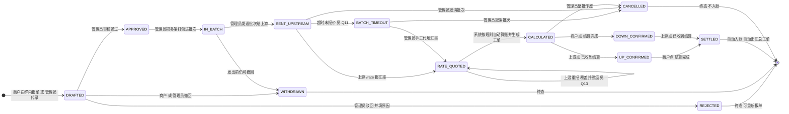
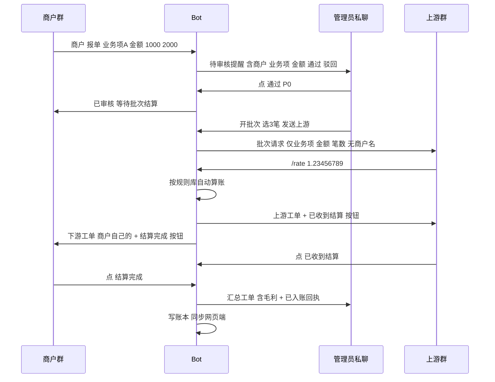

# PRD · 费率结算 Telegram Bot（半自动结算）

| 项目信息 | 内容 |
| --- | --- |
| 文档语言 | 中文 |
| 项目名称 | `fee_settlement_tgbot` |
| 版本 | v0.1（草案，待确认） |
| 撰写 | 许清楚（产品经理） |
| 关联产品 | 费率结算自动计算器 v11（单文件 ES5，已上线 https://akonair.github.io/fee-calculator/） |
| 技术栈说明 | **本项目主体是常驻 Bot 服务，不是 Web 应用**，故不套用 Vite+React+MUI+Tailwind 默认栈。建议 Bot 侧 **Node.js 20 + TypeScript + Telegraf**（或 Python 3.11 + python-telegram-bot），与网页端共用同一套纯函数计算内核。仅当二期做「管理后台 Web」时才启用 Vite + React + MUI + Tailwind。选型需架构师确认（见 Q2）。 |
| 文档状态 | 待评审，含 24 个待确认问题（Q1–Q24），其中 8 个为阻塞项 |

---

## 0. 原始需求复述（用户原话）

> 「如果我想串联起 TGbot 呢？比如说我的 Bot 放进群后，我的商户只需要在群中通过报单功能选择业务项（规则）然后输入金额，确认数据有效的权限在我手上，然后到了批次结算时间，我点击发送审核（权限也在我手上）（实际上是发送至上游），然后上游根据格式比如 `/rate 1.23456789` 这样报汇率，再根据我设定好的对上游的规则和此单对下游（商户）的各业务项（规则）直接算账生成工单，等我全部结算完后上游点击收到结算按钮（下游看不到），下游点击结算完成按钮（上游看不到），两边我都点击后产生汇总工单和记录账目，那我不就半自动化了」

**一句话概括**：让报单、审核、报价、算账、双方确认、入账这六步，从「我一个人手工搬运」变成「各方在 Telegram 里各按一下，规则是我定的，算账是自动的」。

---

## 1. 产品目标

### 1.1 核心目标

把一整批结算从**人工搬运**升级为**规则驱动的半自动流水线**：商户报单 → 我审核 → 上游报价 → 系统按我预设规则自动算账出工单 → 上下游各点一次确认 → 自动汇总 + 自动入账。

### 1.2 具体省掉的人工环节（当前纯手工状态下的 7 步）

| # | 现状（手工） | Bot 化后 |
| --- | --- | --- |
| 1 | 商户在微信/TG 里口头或截图报金额，我手动抄进网页端 | 商户在群里选业务项 + 填金额，结构化入库 |
| 2 | 等上游在聊天里喊汇率，我复制粘贴 | 上游 `/rate` 报汇率，直接进入批次 |
| 3 | 我把汇率逐个填进每个业务项 | 汇率自动套用到批次/业务项 |
| 4 | 我按规则心算/用网页端算实收实付 | 系统按规则库自动算，公式与网页端完全一致 |
| 5 | 我把上游工单/下游工单复制出来，手工拼装发送 | 系统自动生成四类工单并推送到对应群 |
| 6 | 上下游口头说「收到了 / 完成了」，我靠记忆和聊天记录核对 | 双方各点一次按钮，状态机留痕 |
| 7 | 我再把结果抄回网页端账本 | 双方确认后自动入账 + 生成汇总工单 |

### 1.3 具体降低的风险

| 风险 | 现状 | Bot 化后 |
| --- | --- | --- |
| **汇率抄错/算错** | 8 位小数汇率手工复制，错了就真金白银亏损 | 汇率由上游一次性结构化输入，全程不经过人工转录 |
| **确认不同步（最大痛点）** | 上游说收到了、下游说没收到，扯皮无凭据 | 双方确认是独立状态位，谁确认、何时确认，永久留痕 |
| **金额信息串台** | 金额散落在各聊天窗口，上下游可能互相看到 | 按角色隔离，上游永远看不到商户名，商户看不到上游费率（详见 Q1） |
| **账目漏记/重复记** | 忙起来忘记入账或重复入账 | 状态机驱动，入账只发生一次且不可手工绕过 |
| **规则用错** | 多个商户费率方案靠记忆套用 | 规则库统一维护，报单时只能选已配置的业务项 |

### 1.4 明确的非目标（本期不做）

- 不做资金划转 / 钱包对接 / 自动打款，Bot 只做**信息流与工单流**，钱仍然人工转。
- 不替代网页端计算器：网页端仍是「规则配置 + 复杂手工补单 + 报表导出」的主场。
- 不做上游/下游自助注册，账号一律由管理员在后台开通。

---

## 2. 角色与权限模型

### 2.1 三个角色

| 角色 | 现实身份 | 身份识别方式 | 数量 |
| --- | --- | --- | --- |
| **我方 / 管理员（ADMIN）** | Novolink 通道方（用户本人） | Telegram user ID 写死在配置白名单 | 1（可扩到 2–3，见 Q20） |
| **上游 / 资金方（UPSTREAM）** | 提供汇率、收我钱的经纪商/资金方 | user ID 白名单 + 所属群/私聊 | 1–N |
| **下游 / 商户（MERCHANT）** | EC Markets、ZeroMarkets 等我方商户 | user ID 白名单 **或** 群 ID 绑定商户（见 Q5） | 1–N |

### 2.2 权限矩阵（能看什么 / 能点什么）

| 能力 | ADMIN | UPSTREAM | MERCHANT |
| --- | --- | --- | --- |
| 提交报单（选业务项 + 填金额，一次多笔） | ✅（可代商户录） | ❌ | ✅ 仅本商户 |
| 查看**自己**的报单 | ✅ 全部 | ❌ | ✅ 仅本商户 |
| 审核通过 / 驳回单笔或整批 | ✅ | ❌ | ❌ |
| 撤回报单 | ✅ 任何阶段 | ❌ | ✅ 仅限「未审核」状态（窗口期见 Q12） |
| 开启/关闭批次、发送批次给上游 | ✅ | ❌ | ❌ |
| 查看批次金额汇总（去商户名） | ✅ | ✅ **仅上游视图**（无商户名，与网页端上游工单一号） | ❌ |
| `/rate` 报汇率 | ✅（可代填/覆盖） | ✅ | ❌ |
| 查看算账后的**下游结算单**（自己的） | ✅ | ❌ | ✅ 仅本商户 |
| 点击「✅ 已收到结算」 | ✅（可代上游确认） | ✅ | ❌ **看不见此按钮** |
| 点击「✅ 结算完成」 | ✅（可代下游确认） | ❌ **看不见此按钮** | ✅ |
| 查看汇总工单（含我方抬头、毛利） | ✅ **仅管理员可见** | ❌ | ❌ |
| 账本读写、CSV 导出、统计报表 | ✅ | ❌ | ❌ |
| 维护业务规则库（增改费率） | ✅ | ❌ | ❌ |
| 查看操作流水（谁在何时点了什么） | ✅ | ❌ | ❌ |

### 2.3 权限设计三条硬原则

1. **上游永远看不到下游商户身份**。沿用网页端 v10 已确立的口径：上游工单只含「规则 / 汇率 / 费率 / 明细 / 小计 / 总计」，**不含商户名与我方抬头**。Bot 必须原样继承，这是商业底线，不是可选项。
2. **商户永远看不到上游费率与我的毛利**。下游工单只含该商户自己的金额、费后汇率、实付，不含上游费率、不含毛利。
3. **汇总工单（含毛利）只有管理员能看**。这是「两边我都点击后」才产生的内部单据，绝不进任何有外部人员的群。

---

## 3. 核心流程状态机

### 3.1 单笔报单（Order）状态机



**状态位补充**：`UP_CONFIRMED` 与 `DOWN_CONFIRMED` 是两个**并行确认标记**，先后不限，都置位才进 `SETTLED`。Mermaid 中拆成两个中间态表达，实现上建议用 `upConfirmedAt` / `downConfirmedAt` 两个时间戳字段。

### 3.2 状态详解

| 状态 | 进入条件 | 可执行动作 | 参与者 | 异常/超时分支 |
| --- | --- | --- | --- | --- |
| **DRAFTED** 待审核 | 商户提交报单（业务项 + 1~N 个金额），或管理员代录 | 审核通过 / 驳回（必填原因）/ 撤回 / 修改金额 | 商户提交，管理员裁决 | 商户可在审核前撤回；管理员可在任意时刻改金额（见 Q12） |
| **REJECTED** 已驳回 | 管理员点驳回 | 重新报单（新单号） | 管理员 | 终态；驳回原因必须回传给商户 |
| **WITHDRAWN** 已撤回 | 商户或管理员点撤回 | — | 商户（限审核前）/ 管理员（不限） | 终态；已进批次的撤回会把该笔从批次剔除 |
| **APPROVED** 已审核 | 管理员审核通过 | 打包进批次 | 管理员 | 长期未进批次 → 管理员收到待办提醒（P1） |
| **IN_BATCH** 批次中 | 管理员把 1~N 笔并入一个批次 | 发送上游 / 移出批次 | 管理员 | 批次内笔数上限、跨商户混批规则见 Q16 |
| **SENT_UPSTREAM** 已送上游 | 管理员点「发送审核」 | 上游报汇率 / 管理员改派 / 管理员取消 | 上游报价 | **超时未报价**（默认 30 分钟，见 Q11）→ 提醒 → 管理员代填或取消 |
| **RATE_QUOTED** 已报价 | 上游 `/rate <值>` 成功 | 自动算账 / 上游重报 / 管理员覆盖 | 上游、管理员 | 汇率合法性校验（正数、最多 10 位小数、与上一批偏离超 X% 需二次确认，见 Q14） |
| **CALCULATED** 已算账 | 系统算出实收/实付/毛利并生成三类工单 | 上游点「已收款」/ 商户点「结算完成」/ 管理员整批作废 | 上游、商户 | 双方任一长时间未确认 → 提醒（P1）；数字有误 → 只能作废重开，**不允许就地改数字**（防篡改原则） |
| **UP_CONFIRMED / DOWN_CONFIRMED** 单边已确认 | 一方点了确认按钮 | 另一方补点 | 上游 / 商户 | 另一方超时 → 管理员提醒或代确认（代确认需二次确认，见 Q19） |
| **SETTLED** 已结算 | 双方确认标记都置位 | 只读；可重发工单 | 系统自动 | **自动动作**：① 生成汇总工单推给管理员 ② 写账本（每规则 × 每金额一条，沿用网页端 ticketId 关联）③ 推送入账回执给管理员 |
| **CANCELLED** 已取消 | 管理员主动取消，或超时后管理员选择取消 | — | 管理员 | 终态，不入账；取消原因留痕 |

### 3.3 双群消息时序（推荐方案 A，见 Q1）



---

## 4. 用户故事

### 4.1 管理员（我方 / Novolink）

| ID | 用户故事 | 优先级 |
| --- | --- | --- |
| US-A1 | 作为**通道方**，我希望商户的报单以结构化方式进系统（业务项 + 金额），而不是截图或口头报数，这样我不用手工转录、也不会抄错 | **P0** |
| US-A2 | 作为**通道方**，我希望**只有我能点审核通过**，这样错误金额不会流到上游去 | **P0** |
| US-A3 | 作为**通道方**，我希望把审核过的多笔打包成一个批次一次性发给上游，这样不用一笔一发 | **P0** |
| US-A4 | 作为**通道方**，我希望上游用 `/rate 1.23456789` 报汇率后，系统自动按我预设的规则算出实收/实付/毛利并出工单，这样我不用碰计算 | **P0** |
| US-A5 | 作为**通道方**，我希望上游点「已收款」、商户点「结算完成」这两个按钮**互相看不见**，这样上下游不知道彼此的进度和存在 | **P0** |
| US-A6 | 作为**通道方**，我希望两边都点完后自动产生汇总工单并自动入账，这样我不用再抄一遍账本 | **P0** |
| US-A7 | 作为**通道方**，我希望上游永远看不到商户名、商户永远看不到上游费率和我的毛利 | **P0** |
| US-A8 | 作为**通道方**，我希望上游迟迟不报汇率时能收到提醒，并能手工代填汇率兜底 | **P1** |
| US-A9 | 作为**通道方**，我希望能驳回单笔或整批，并填写驳回原因回传给商户 | **P1** |
| US-A10 | 作为**通道方**，我希望能按日期/商户导出对账报表，并与网页端账本对得上 | **P1** |
| US-A11 | 作为**通道方**，我希望查看完整操作流水（谁在几点几分点了什么），出问题时可追责 | **P1** |
| US-A12 | 作为**通道方**，我希望商户能用他自己国家的语言（英/马/越/韩）收到工单 | **P2** |
| US-A13 | 作为**通道方**，我希望结算时间到点时 Bot 自动催上游报价、催双方确认 | **P2** |

### 4.2 上游（资金方）

| ID | 用户故事 | 优先级 |
| --- | --- | --- |
| US-U1 | 作为**上游**，我希望收到一个干净的批次请求（只有业务项和金额，没有商户名），我直接报汇率就行 | **P0** |
| US-U2 | 作为**上游**，我希望用 `/rate 1.23456789` 一条命令报汇率，不用进任何系统 | **P0** |
| US-U3 | 作为**上游**，我希望算完账后看到明确的应收款，并有一个「已收到结算」按钮给我点 | **P0** |
| US-U4 | 作为**上游**，我希望汇率报错了可以重报一次 | **P1** |
| US-U5 | 作为**上游**，我不希望看到任何关于下游商户的信息 | **P0**（安全约束，同 US-A7） |

### 4.3 下游（商户）

| ID | 用户故事 | 优先级 |
| --- | --- | --- |
| US-M1 | 作为**商户**，我希望在群里点「报单」，从我能用的业务项里选一个，然后输入金额（可以一次填多笔），就完成报单 | **P0** |
| US-M2 | 作为**商户**，我希望看到我的报单被审核通过了还是被驳回了，驳回要有原因 | **P0** |
| US-M3 | 作为**商户**，我希望结算时收到一张只看得懂我自己的结算单（金额、汇率、实付），并点「结算完成」确认 | **P0** |
| US-M4 | 作为**商户**，我希望在审核前能撤回填错的金额 | **P1** |
| US-M5 | 作为**商户**，我希望用我自己熟悉的语言（中/英/马/越）看到工单 | **P2** |

---

## 5. 需求池

### 5.1 P0（Must have —— 不做就跑不通半自动化）

| ID | 功能点 | 说明 | 理由 |
| --- | --- | --- | --- |
| F01 | **业务规则库（Rule）** | 复用网页端模型：规则名 / 上游费率% / 上游单笔加收(±) / 下游费率% / 下游单笔加收(±) / 归属商户 / 货币对。规则库是 Bot 的「大脑」 | 没有规则库就无法「按我设定好的规则直接算账」，这是整个产品的地基 |
| F02 | **计算内核移植** | 把网页端 `compute()` 纯函数原样移植到 Bot 侧：`实收 = 金额 × (汇率 + 上游加收) × (1 − 上游费率%)`；`实付 = 金额 × (汇率 + 下游加收) × (1 − 下游费率%)`（含Gas再 −1.2）；`毛利 = 实收 − 实付`；内部精度 8 位、费后汇率 10 位。**必须与网页端逐位一致** | 两套算法算出不同数字 = 信任崩塌。必须共用同一份公式与精度规则 |
| F03 | **商户报单（一次多笔）** | 群内 `/order` 或按钮 → 选业务项（Inline 键盘，只列该商户可用规则）→ 输入 1~N 个金额（一行一个或逗号分隔）→ 可选勾选含Gas → 提交生成 DRAFTED 单 | 用户明确要求「选择业务项（规则）然后输入金额」，且要支持一次多笔 |
| F04 | **管理员审核** | 管理员私聊/管理群收到待办卡片，含「✅ 通过 / ❌ 驳回（需填原因）」；支持单笔与批量通过 | 「确认数据有效的权限在我手上」——这是用户明确要的控制点 |
| F05 | **批次打包 + 发送上游** | 管理员选 1~N 笔组成批次 → 生成**上游视图工单**（去商户名、去我方抬头）→ 推送到上游群 | 「到了批次结算时间，我点击发送审核」 |
| F06 | **上游 `/rate` 报汇率** | 上游群内 `/rate 1.23456789` 或 `/rate <业务项名> <值>`；校验正数、小数位 ≤10、偏离上一批超阈值需管理员确认 | 「上游根据格式比如 /rate 1.23456789 这样报汇率」 |
| F07 | **自动算账 + 生成工单** | 汇率到位后自动按规则库计算，产出三类工单：上游工单（无商户）、下游工单（按商户分段）、汇总工单（含毛利，仅管理员） | 「直接算账生成工单」——这是核心价值点 |
| F08 | **工单 Telegram 制式** | 沿用 v10/v11 规范：**每个数字单独用单反引号包裹**，货币符号/百分号留在外面；emoji 头（📋💰✅🏢）+ 分隔线；四类工单全文四语 | 这是现有产品打磨了 4 个版本的核心体验（手机点按复制纯数字），Bot 必须 100% 继承 |
| F09 | **隔离确认按钮** | 上游「✅ 已收到结算」与商户「✅ 结算完成」在各自群里，互不可见（方案见 Q1） | 用户明确要求；也是 Q1 的核心议题 |
| F10 | **双方确认后自动汇总 + 入账** | 两个确认标记都置位 → ① 生成汇总工单推管理员 ② 按「每规则 × 每金额」写账本，统一 ticketId ③ 推入账回执 | 「两边我都点击后产生汇总工单和记录账目」 |
| F11 | **账本模型兼容** | 账目字段与网页端 15 列一致（时间/类型/抬头/商户/规则/笔序/金额/汇率/费率/实收/实付/毛利/批次/工单号/备注），保证导入网页端不掉字段 | 否则账目回不到网页端，半自动化只做了一半 |
| F12 | **角色身份白名单** | 用 Telegram user ID 白名单判定 ADMIN/UPSTREAM/MERCHANT；非法身份点任何按钮均提示「无权操作」且记流水 | 权限模型的落地点 |
| F13 | **操作流水留痕** | 每次状态迁移记录 `{时间, 操作人ID, 角色, 动作, 单号, 前后值}`，不可删除 | 支付行业必备，也是扯皮时的唯一凭据 |

### 5.2 P1（Should have —— 影响可用性和健壮性）

| ID | 功能点 | 说明 | 理由 |
| --- | --- | --- | --- |
| F14 | 商户在审核前撤回/修改报单 | 金额填错是高频场景 | 否则只能靠管理员驳回，来回成本高 |
| F15 | 单笔驳回 + 整批驳回，驳回原因回传商户 | — | 异常流程闭环 |
| F16 | 汇率报错重报 + 管理员覆盖汇率 | 上游手抖报错是常态 | 没有重报就只能作废重开 |
| F17 | 报价超时提醒 + 管理员代填兜底 | 默认 30 分钟（可调） | 「上游迟迟不报汇率」是用户点名的异常场景 |
| F18 | 双方确认超时提醒 | 默认 4 小时（可调） | 单边卡住整批不入账 |
| F19 | 整批取消 + 已确认状态下作废（需二次确认） | — | 兜底手段 |
| F20 | 账目同步回网页端 | 方案见 Q3（GitHub 中间层 / 导出导入 / API） | 「记录账目」要能回到我熟悉的账本里 |
| F21 | 多币种 / 货币对支持 | 继承网页端 66 种货币 + 自定义 | 用户对接韩/东南亚/中国，币种不唯一 |
| F22 | 对账报表与 CSV 导出 | 按日期/商户/批次维度 | 月度对账刚需 |
| F23 | Bot 健康检查 + 掉线告警 | 掉线时给管理员发心跳（用第三方监控或自轮询） | 结算高峰掉线 = 业务停摆 |

### 5.3 P2（Nice to have —— 二期）

| ID | 功能点 | 说明 |
| --- | --- | --- |
| F24 | 定时提醒/催收（结算时间到点自动开批、催报价、催确认） | 需要 cron 能力，依赖部署方式 |
| F25 | 韩语（ko）加入四语体系 | 现有网页端是 中/英/马/越，用户有韩国商户 |
| F26 | 管理后台 Web（Vite + React + MUI + Tailwind） | 规则配置、账本查询、流水审计的可视化后台 |
| F27 | 商户自助查询历史结算单 | `/myorders`、`/mystatement` |
| F28 | 多管理员 + 分级权限 | 一人管不过来时 |
| F29 | 汇率偏离预警（与公开市场价对比） | 防止上游报错价 |
| F30 | 自动对账（银行流水 / 链上记录比对） | 需要外部数据源，远期 |

---

## 6. 交互与文案草案

> 中文为准；标注 **[四语]** 的需同步产出 English / Bahasa Melayu / Tiếng Việt 版本（可直接复用网页端 `I18N` 词典的词条命名与翻译，新增词条需补齐）。数字一律单反引号包裹。

### 6.1 商户报单（商户群）

**入口**：商户发 `/order`，Bot 回复业务项选择键盘。

```
📋 请选择业务项 **[四语]**
────────────
[ 欧洲A方案 ]  [ 东南亚B方案 ]
[ 韩元通道 ]   [ 自定义通道 ]
```

**选中业务项后**：

```
✅ 已选择：欧洲A方案
💱 货币对：EUR → USDT

请输入金额（可一次多笔）：
· 每行一个，或逗号分隔
· 例：`1000` 或 `1000, 2000, 3500`

需要商户承担 Gas Fee 请回复 /gas  **[四语]**
```

**提交后确认卡**（商户可见）：

```
📋 报单已提交，等待审核 **[四语]**
────────────
🏢 商户：EC Markets
▎业务项：欧洲A方案
▎#1 `1,000.00` EUR
▎#2 `2,000.00` EUR
▎合计 `3,000.00` EUR（2 笔）
────────────
⏳ 状态：待审核
💡 审核通过前可点「撤回」修改
[ ↩ 撤回 ]  [ ＋ 继续报单 ]
```

### 6.2 管理员审核（管理员私聊 / 管理群）

```
🔔 待审核报单 · 共 `3` 笔
────────────
🏢 EC Markets · 欧洲A方案
▎#1 `1,000.00` EUR
▎#2 `2,000.00` EUR
▎合计 `3,000.00` EUR（2 笔）
▎报单人：@user · 10-09 14:32
────────────
[ ✅ 通过 ]  [ ❌ 驳回 ]  [ ✏ 改金额 ]
[ ✅ 全部通过（3 笔）]
```

驳回后 → Bot 要求输入原因，并把原因原样推回商户群：

```
❌ 报单已驳回 **[四语]**
▎原因：金额与银行水单不符，请核对后重报
```

### 6.3 批次发送上游（上游群）

```
📤 批次结算请求 · `B20260910-01` **[四语]**
────────────
▎业务项：欧洲A方案
▎#1 `1,000.00`
▎#2 `2,000.00`
────────────
▎业务项：韩元通道
▎#1 `5,000.00`
────────────
✅ 合计 `3` 笔

请回复汇率：
`/rate 1.23456789`
（或按业务项分别报：`/rate 欧洲A方案 1.23456789`）
```

> ⚠️ **此消息严禁出现商户名与我方抬头**（硬约束，同网页端上游工单）。

### 6.4 上游报汇率

上游：`/rate 1.23456789`

Bot 回复（上游群 + 管理员同步）：

```
✅ 汇率已记录 **[四语]**
▎批次：`B20260910-01`
▎汇率：`1.23456789`
▎报价人：@upstream · 10-09 15:02
────────────
⏳ 正在按规则算账…

如需修改，重新发送 /rate 即可覆盖
```

**异常提示**：

| 场景 | 文案 |
| --- | --- |
| 格式错误 | `❌ 汇率格式不对，请按 /rate 1.23456789 再试一次 **[四语]**` |
| 非正数 | `❌ 汇率必须大于 0` |
| 偏离上一批 > 阈值（默认 5%，见 Q14） | `⚠️ 本次汇率 `1.30` 与上一批 `1.16` 偏离 `12.1%`，已通知管理员确认。如无误请再次发送 /rate 确认。**[四语]**` |
| 无权限 | `⛔ 无权操作` |

### 6.5 算账完成后 —— 三张工单分别推送

**① 上游群**（含确认按钮，商户看不见）：

```
📋 上游结算工单 · `B20260910-01` **[四语]**
────────────
▎业务项：欧洲A方案
▎汇率 `1.23456789`
▎费率 `2`% · 单价 `+0.01` · 费后 `1.21907474`
▎#1 `1,000.00` → 实收 `1,219.0747400`
▎#2 `2,000.00` → 实收 `2,438.1494800`
▎小计实收 `3,657.2242200`（2 笔）
────────────
✅ 总计实收 `3,657.2242200` USDT（2 项业务 · 3 笔）
────────────
[ ✅ 已收到结算 ]
```

**② 商户群**（按商户分段，含确认按钮，上游看不见）：

```
📋 下游结算工单 · `B20260910-01` **[四语]**
────────────
🏢 EC Markets
▎业务项：欧洲A方案
▎汇率 `1.23456789`
▎费率 `5`% · 费后 `1.17296249`
▎#1 `1,000.00` → 实付 `1,172.9624900`
▎#2 `2,000.00` → 实付 `2,345.9249800`
────────────
▎商户小计实付 `3,518.8874700`（2 笔）
────────────
✅ 总计实付 `3,518.8874700` USDT
────────────
[ ✅ 结算完成 ]
```

**③ 管理员私聊**（汇总工单，含毛利）：

```
💰 结算汇总工单（内部）· `B20260910-01`
────────────
▎我方抬头：Novolink
▎批次：`B20260910-01`
────────────
🏢 EC Markets
▎实收 `3,657.2242200` · 实付 `3,518.8874700` · 毛利 `138.3367500`
────────────
💰 总计 实收 `3,657.2242200` · 实付 `3,518.8874700` · 毛利 `138.3367500`
（2 项业务 · 3 笔 · 1 个商户）
────────────
⏳ 等待双方确认后自动入账
```

### 6.6 确认与结算完成

**上游点「✅ 已收到结算」后**（仅上游群与管理端可见）：

```
✅ 上游已确认收款
▎批次：`B20260910-01` · @upstream · 10-09 15:20
⏳ 等待商户确认
```

**商户点「✅ 结算完成」后**（仅商户群与管理端可见）：

```
✅ 结算完成，感谢配合 **[四语]**
▎批次：`B20260910-01` · 10-09 15:22
```

**双方都点完 → 管理员私聊**：

```
🎉 批次 `B20260910-01` 已结算
────────────
💰 实收 `3,657.2242200` · 实付 `3,518.8874700` · 毛利 `138.3367500`
▎商户数 `1` · 业务 `2` 项 · `3` 笔
▎工单号：`T1757488800123`
────────────
✅ 已自动入账（3 条）
[ 📊 查看汇总工单 ]  [ 📥 导出 CSV ]
```

### 6.7 主要命令清单

| 命令 | 角色 | 说明 |
| --- | --- | --- |
| `/order` | 商户 / 管理员 | 发起报单 |
| `/myorders` | 商户 | 查看我的报单（P2） |
| `/pending` | 管理员 | 查看待审核列表 |
| `/batch new` / `/batch send` | 管理员 | 开批次 / 发送上游 |
| `/rate <值>` / `/rate <业务项> <值>` | 上游 / 管理员 | 报汇率 |
| `/cancel <批次号>` | 管理员 | 取消批次 |
| `/void <批次号>` | 管理员 | 已算账批次作废（二次确认） |
| `/listrules` | 管理员 | 查看规则库 |
| `/setrule …` | 管理员 | 应急改规则（仅私聊，见 Q4） |
| `/importrules` | 管理员 | 粘贴网页端导出的规则 JSON |
| `/export` | 管理员 | 导出账目 CSV / JSON |
| `/lang <zh/en/ms/vi>` | 管理员 | 设置该群/该用户语言（见 Q18） |
| `/whoami` | 全部 | 查看自己的身份 ID（用于配白名单） |

---

## 7. 待确认问题清单

> 每个问题都标注：**为什么必须确认** + **不确认时我的默认建议**。
> 🔴 = 阻塞项（不确认就无法开工）。

---

### 🔴 Q1. Telegram 无法在同一群内对特定成员隐藏 Inline 按钮 + 金额隔离

**问题**：你要的「上游点收到结算（下游看不到）/ 下游点结算完成（上游看不到）」在**单个群**内技术上做不到 —— Telegram 的 Inline Keyboard 是**消息级别的**，同一条消息的按钮对所有能看到这条消息的人可见、可点。此外还有个更严重的问题：**同一个群里，上游和下游会互相看到对方的金额、费率、笔数**，这在支付结算业务里是不可接受的。

**三个方案对比**：

| | 方案 A：双群/三群（Bot 作桥梁） | 方案 B：单群 + 点击后校验身份 | 方案 C：单群 + 私聊确认 |
| --- | --- | --- | --- |
| **做法** | 上游群（我+上游+Bot）、商户群（我+商户+Bot）、管理私聊（我+Bot）三个独立会话，Bot 在中间转发 | 一个群，按钮对所有人可见，无权限者点下去弹「⛔ 无权操作」 | 一个群发工单，确认按钮通过 Bot 私聊发给对应人 |
| **信息隔离** | ✅ **完全隔离**，金额/费率/商户名按角色分发 | ❌ **完全不隔离**，上游能看到商户的实付金额与笔数，商户能看到上游的实收 | ⚠️ 群内金额仍互相可见，仅确认动作隔离 |
| **按钮隔离** | ✅ 天然实现 | ❌ 按钮可见，只是点不动（社交上很尴尬：上游看到「结算完成」按钮的存在） | ✅ 按钮在私聊，他人不可见 |
| **实现复杂度** | 中（需维护群↔角色↔商户绑定表） | 低 | 中（**致命点：Bot 无法主动给没私聊过它的人发消息**，上游/商户必须先 /start 过） |
| **运维成本** | 中：管理员要看 2–3 个会话 | 低：只看 1 个群 | 中 |
| **扩展性** | ✅ 多商户、多上游都好扩展 | ❌ 商户一多就乱 | ⚠️ 一般 |
| **风险** | 需要上游/商户同意进专门的群 | **商业泄密风险**，且不符合支付行业惯例 | 上游可能压根没私聊过 Bot，流程卡死 |

**我的推荐：方案 A（双群/三群），理由三条**

1. **你真正要的不是「按钮隔离」，而是「信息隔离」**。按钮只是表象。上游知道你有哪些商户、每家走多少量，等于把你的商业底盘交出去了。这条是硬底线。
2. 现有网页端 v10 已经把「上游工单不含商户名、下游工单按商户分段、汇总工单只给自己看」这三件事做成了产品规范，Bot 理应延续这个信息分层设计 —— 而这套分层天然就对应三个会话。
3. 成本可控：你本来就要和上游、和商户分别沟通，只是从「两个微信窗口」变成「两个 TG 群」。

**折中方案（如果你强烈想少开群）**：方案 A 为基础，但支持 `/mode single` 降级到单群模式（方案 B 的行为），用于只有你自己 + 一个可信上游 + 无商户在群的场景（比如测试群）。

**为什么必须确认**：直接决定数据模型（会话绑定表）和工作量，选错了整套要重做。
**默认建议**：**方案 A（三会话：上游群 / 商户群 / 管理员私聊）**。若你希望商户之间也互相隔离，则每个商户一个群（见 Q5）。

**附带确认**：
- Q1.1 上游是「一个群一个上游」还是「一个群多个上游」？
- Q1.2 是否需要在商户群里隐藏「其他商户也在跟我们合作」这件事？（→ 决定一商户一群）

---

### 🔴 Q2. Bot 部署与运行方式

**选项**：

| 方案 | 成本 | 优点 | 缺点 |
| --- | --- | --- | --- |
| **A. 本地 Mac 常开（Long Polling）** | ¥0 | 数据在手、零配置、不需要公网 IP | 电脑关机/休眠/断网 = Bot 掉线；结算常在夜间，风险高；家里断电/网络波动无法保障 |
| **B. 云服务器 VPS（推荐）** | ¥30–100/月（腾讯云轻量 / Vultr / Hetzner） | 7×24 稳定、可用 Webhook、可跑 cron 定时提醒、可放 SQLite | 需要一点运维（SSH、进程守护 systemd/pm2、定期备份） |
| **C. Serverless（Cloudflare Workers / Deno Deploy / Vercel）** | 免费额度通常够 | 免运维、不怕掉线 | 只能用 Webhook（冷启动 100–500ms，可接受）；**不能写本地文件**，状态必须放 D1/KV/外部 DB；定时任务用 Cron Triggers；调试相对麻烦 |
| **D. 你有现成服务器** | ¥0 | — | — |

**为什么必须确认**：决定了存储选型（Q3）、定时任务能力（F24）、以及能不能用最简单的 JSON 文件存数据。Serverless 下「写 JSON 文件」这条路直接堵死。
**默认建议**：**MVP 阶段用 A（本地 Mac 跑 Long Polling）快速验证流程跑得通不通**，同时代码按 B 的约束写（不依赖本地文件系统绝对路径、配置走环境变量）。验证通过（约 1–2 周）后迁到 **B（一台最低配 VPS，¥30–50/月）**，用 pm2 守护 + 每日自动备份 SQLite 到 GitHub 私有仓库。如果你明确说自己不想碰服务器，则选 C（Cloudflare Workers + D1）。

**附带确认**：
- Q2.1 你是否已有 VPS / 云服务器？在哪家？
- Q2.2 是否能接受每月几十块钱的服务器成本？
- Q2.3 Bot 掉线最长可容忍多久？（决定要不要做健康检查告警 F23）

---

### 🔴 Q3. 数据存放 & 与网页端 localStorage 的关系（账目双向同步）

**问题**：现有网页端是**纯前端 localStorage**，数据只在浏览器里，没有任何服务端。Bot 是服务端程序。两者天然不互通。

**Bot 侧存储选型**：

| 方案 | 适用 | 评价 |
| --- | --- | --- |
| **SQLite（单文件）** | VPS / 本地 | ✅ **默认推荐**。零运维、单文件备份、支持事务、够用到几十万条账目 |
| JSON 文件 | 本地 MVP | ⚠️ 最简单，但并发写会丢数据，只能用于 MVP 试跑 |
| PostgreSQL | 多人/多实例 | ❌ MVP 阶段过度设计 |
| Cloudflare D1 / KV | Serverless 部署时 | ✅ 若选 Q2-C 则用这个 |
| Redis | — | ❌ 只适合做缓存，不适合做主存 |

**与网页端同步的方案（这是真正的难点）**：

| 方案 | 做法 | 优点 | 缺点 |
| --- | --- | --- | --- |
| **S1. Bot 为准 + GitHub 作同步总线（推荐）** | Bot 与网页端读写**同一个 GitHub 私有仓库的 `fee-calculator/data.json`**。网页端已有完整的 GitHub 备份/恢复能力（Base64 + sha 乐观锁，v9 已实现），Bot 侧用同一份 JSON schema + GitHub API 读写即可 | **零额外后端**；完全复用现有 v9 代码资产；网页端「单文件零依赖」的核心优势不被破坏；一份数据两处都能看 | 有秒级~分钟级延迟；并发写需靠 sha 重试；GitHub API 限流 5000 次/小时（远超实际需求）；需要给 Bot 一个 PAT |
| **S2. Bot 为准 + 网页端调 Bot API** | Bot 暴露 HTTPS API，网页端改造为从此 API 读写账目 | 实时、单一数据源 | **破坏网页端「离线可用、零依赖」的核心设计**；需要给网页端加鉴权；Bot 挂了网页端也跟着不能记账；CORS/HTTPS 一堆麻烦 |
| **S3. 双写 + 人工导入导出** | Bot 与网页端各存各的，靠 `/export` 导出 CSV/JSON → 网页端「导入」 | 改动最小，两边都不用动架构 | **会不一致**，需要人工记得导，忘了就对不上账 |
| **S4. 网页端降级为纯计算器** | 明确「账本只在 Bot 侧」，网页端只负责规则配置 + 复杂补单 + 报表 | 职责清晰 | 网页端的账本/统计功能要废弃或只读化 |

**为什么必须确认**：这是整个项目架构上最大的分叉点。选 S2 意味着要改造已上线的网页端（回归测试成本大，v8/v9/v10/v11 共 224 条断言要重跑）；选 S1 则几乎不动网页端。
**默认建议**：
- **存储：SQLite**（若最终部署 Serverless 则换 D1）。
- **同步：MVP 用 S1（GitHub 总线）+ S3（导出兜底）**。具体做法：Bot 每次入账后，把全量数据（账目 + 规则 + 货币）打包成与网页端 v9 **完全相同格式**的 JSON，commit 到私有仓库；网页端点「从云端恢复」即拉取（现有代码已支持按 ticketId 去重合并）。反之，网页端规则改动后点「立即备份」，Bot 侧定时（或 `/importrules`）拉取。
- **单一事实来源原则**：明确 **「账目以 Bot 为准」**，网页端的账本视为**只读副本**，网页端手工补单后必须点「云备份」否则会被 Bot 的下一次提交覆盖（这点要在 UI 上提示）。
- 二期若需要实时性再评估 S2。

**附带确认**：
- Q3.1 你现有的 GitHub 私有备份仓库是哪个？能否给 Bot 一个 fine-grained PAT（Contents: Read & Write）？
- Q3.2 能否接受「网页端账本是只读副本」这个定位？
- Q3.3 账目量级大概多少条/月？（决定 SQLite 够不够、要不要分区）

---

### 🔴 Q4. 业务规则（业务项）在哪维护

**选项**：

| 方案 | 优点 | 缺点 |
| --- | --- | --- |
| **A. 网页端维护 → 同步给 Bot** | 表单式录入，6 个字段 + 商户归属，体验远好于命令行；现有网页端已有完整的规则预设 UI（v7/v8） | 需要解决同步（同 Q3） |
| **B. Bot 内 `/setrule` 维护** | 改完立即生效，无需同步；在任何地方都能改 | 命令行录 6 个字段极易出错；**规则是核心商业资产，不该在任何有外部人员的群里以明文命令出现**；没有历史版本 |
| **C. 网页端维护 + Bot 只读 + Bot 应急改（混合）** | 兼顾 | 需要防止两边冲突 |

**规则归属问题**：规则是**全局共用**（所有商户都能选）还是**绑定商户**（每商户有自己的费率方案）？从你「对下游（商户）的各业务项（规则）」的表述看，我理解是**按商户定制费率**，但存在一个全局规则库 + 商户可见性配置。

**为什么必须确认**：规则是 Bot 算账的输入，规则错 = 钱算错。而且规则的录入方式直接决定日常运维工作量。
**默认建议**：
- **日常维护走网页端**（方案 A），Bot 侧通过 `/importrules` 导入网页端导出的 JSON，或走 Q3 的 GitHub 总线自动同步。
- Bot 侧保留 `/listrules`（只读查看）和 `/setrule`（应急修改，**仅限管理员私聊**，且修改后自动写流水 + 自动回推网页端）。
- **规则模型**：全局规则表 `rules(rule_id, 名称, 上游费率%, 上游加收, 下游费率%, 下游加收, 货币对)` + 商户可见性表 `merchant_rules(merchant_id, rule_id)`。商户报单时只能看到属于自己的规则。这样一套「欧洲A方案」可以给多家商户配不同费率（用规则副本 + 商户绑定实现）。

**附带确认**：
- Q4.1 一个业务项（规则名）会对多家商户用**不同费率**吗？（→ 决定要不要「规则模板 + 商户覆盖费率」两层结构）
- Q4.2 规则改动后，历史上已结算的单据要不要保留当时的费率快照？（**默认建议：必须快照**，否则改一次规则，历史账全变，对不上账）

---

### 🔴 Q5. 群 ↔ 商户映射：一商户一群，还是一群多商户

| 方案 | 优点 | 缺点 |
| --- | --- | --- |
| **A. 一商户一群** | 群即身份，报单时**不用选商户**（不会选错）；商户之间完全隔离；可按商户设语言 | 商户多则群多（10 个商户 = 10 个群） |
| **B. 一群多商户** | 群少，好管理 | 报单时必须选商户，**容易选错导致金额挂到别人账上**；商户之间互相可见（商业泄密） |
| **C. 商户全部走私聊，不用群** | 隔离最彻底 | 商户可能不爱私聊机器人；你要在 N 个私聊窗口之间切 |

**为什么必须确认**：决定报单交互（要不要选商户）和绑定表结构。选错会导致金额挂错商户 —— 这是会造成实际损失的错误。
**默认建议**：**A（一商户一群）**，群名 = 商户名，Bot 进群时用 `/bind <商户名>` 绑定 `chat_id ↔ merchant_id`，报单自动带出商户，管理员可在 `/bind` 里改。二期再支持 B（一群多商户 + 报单选商户）。
**附带确认**：
- Q5.1 你现在大概有几个活跃商户？预计半年内会到几个？
- Q5.2 群里除了商户本人，会不会有商户的多个员工报单？（→ 决定要不要「群内用户 → 商户」二级映射，还是「群 → 商户」就够）
- Q5.3 商户报单时是否还需要填「我方抬头 / 批次号 / 备注」？（现有网页端抬头选填、批次选填）

---

### 🔴 Q6. 上游报的汇率是「整批一个」还是「每笔不同」

**三种粒度**：

| 粒度 | 交互 | 数据模型 |
| --- | --- | --- |
| **A. 整批一个汇率** | `/rate 1.23456789` 一次搞定，批次内所有业务项共用 | 最简单，与你原文一致 |
| **B. 每个业务项（规则）一个汇率** | `/rate 欧洲A方案 1.23456789`，逐项报 | 符合现有模型（rate 挂在 rule 上），一个批次含多个规则时需要 |
| **C. 每笔一个汇率** | 上游要报 N 次 | 复杂度高，上游会崩溃 |

**为什么必须确认**：直接决定批次数据结构和上游的交互次数。选 A 但业务上需要 B，会导致汇率套错业务项。
**默认建议**：**支持 A + B 混合** —— 上游先报一个批次默认汇率（A），如需对某个业务项单独报价，再报 `/rate <业务项名> <值>` 覆盖（B）。`/rate` 只带一个数字 = 批次默认汇率。这样上游 90% 的情况一条命令搞定，特殊情况也兜得住。C 不做。

**附带确认**：
- Q6.1 一个批次里会同时有多个业务项（规则）吗？如果有，它们的汇率通常相同还是不同？
- Q6.2 上游报价时，是否需要他同时报「上游费率」而不只是汇率？（现有模型里费率是我预设的规则，但也可能上游每次变）

---

### 🔴 Q7. Bot Token 与账号

**为什么必须确认**：没有 Token 什么都做不了；Token 的保管方式涉及安全。
**问题**：
- Q7.1 Bot 是否已通过 @BotFather 创建？Token 是否可交给我方（部署方）保管？
- Q7.2 如果不想交 Token：可由你自己在 BotFather 创建后，把 Token 填进服务器环境变量（你看不到代码里的明文，但部署方能看到）—— 需明确信任边界。
- Q7.3 Bot 的用户名（@xxx_bot）希望叫什么？
- Q7.4 Bot 是否需要关闭 `Privacy Mode`（`/setprivacy` → Disable）？**必须关闭**，否则 Bot 在群里收不到非 `/` 开头的普通消息（会影响「直接输入金额」的交互）。

**默认建议**：你自己在 BotFather 创建 + 关闭 Privacy Mode + 把 Token 通过环境变量注入部署环境。同时在 BotFather 里设置 Bot 头像、简介、命令列表（`/setcommands`）。

---

### 🟡 Q8. 报单由谁发起

- Q8.1 商户会自己在群里用 Bot 报单，还是你代他们录？
- **为什么必须确认**：如果商户不会用/不愿用，那 F03 的交互设计要改成「管理员快速代录」的极简模式（甚至支持你转发商户消息给 Bot 让它解析），优先级完全不一样。
- **默认建议**：MVP 两者都做（商户自助 + 管理员 `/order for <商户>` 代录），但把管理员代录做顺手，作为商户不配合时的兜底。

---

### 🟡 Q9. 上游在群里还是私聊 / 上游有几个

- 上游是一个人还是一个团队（多个人）？多个上游时，一个批次是发给**所有**上游还是**指定一个**？
- **默认建议**：先按「一个批次 → 一个指定上游」实现，数据模型预留 `upstream_id` 字段。

---

### 🟡 Q10. 批次是怎么形成的（什么时候算一个批次）

- 是**定时**（每天 15:00 结算一次）？**按笔数攒够**？还是**你手动开批**？
- **为什么必须确认**：决定要不要做定时任务（F24 优先级）和「批次」这个概念在 UI 上怎么呈现。
- **默认建议**：MVP 手动开批（`/batch new` → 勾选待结算单 → `/batch send`），最符合你「到了批次结算时间，我点击发送审核」的描述。定时开批放 P2。

---

### 🟡 Q11. 上游迟迟不报汇率 —— 超时规则

- 等多久算超时？（默认 **30 分钟**）
- 超时后：① 提醒上游 + 提醒你 → ② 再等一轮 → ③ 你手工代填汇率 or 取消批次？
- 汇率代填时，用什么值？（上一批汇率 / 你自己估 / 市场上的参考价）
- **默认建议**：30 分钟首提醒，60 分钟二次提醒，此后不自动处理，等你决定（代填或取消）。**绝不自动套用上一批汇率**（风险太高）。

---

### 🟡 Q12. 报单修改 / 撤回的窗口期

- 商户能在哪个阶段前撤回？（默认：**审核前**）
- 审核通过后、进批次前，商户还能撤回吗？（默认：**不能**，只能找管理员）
- 管理员能在任何阶段改金额吗？（默认：**能，但改后必须重新走审核**，且记流水）
- 已算账（CALCULATED）之后发现金额错了怎么办？（默认：**只能整批作废重开，不允许就地改数字** —— 防篡改原则）

---

### 🟡 Q13. 汇率报错重报

- 上游报错后重报，是直接覆盖，还是要管理员确认？（默认：**直接覆盖，但保留全部历史报价记录 + 通知管理员**）
- 已经算完账、工单都发出去了，上游才说报错了怎么办？（默认：走整批作废 `/void`，重新报价重算）
- 覆盖次数是否限制？（默认：不限，但每次都留痕）

---

### 🟡 Q14. 汇率偏离预警阈值

- 与上一批汇率偏离多少百分比时触发预警？（默认 **5%**）
- 触发后是「阻断等管理员确认」还是「仅提醒，继续算账」？（默认：**阻断 + 通知管理员**，等你点确认才继续 —— 汇率错一位小数就是真金白银）
- 是否需要和市场公开价对比？（P2，需要外部数据源）

---

### 🟡 Q15. 驳回粒度

- 支持**单笔驳回**还是只能**整批驳回**？（默认：都支持，商户报单阶段是单笔，批次阶段是整批）
- 驳回是否必须填原因？（默认：**必须**，否则商户不知道错在哪，会重复报一样的错）
- 被驳回的单能否「修改后重新提交」还是必须重新报单？（默认：**可修改后重提，保留原单号 + 版本号**）

---

### 🟡 Q16. 批次混批规则

- 一个批次里可以混**不同商户**的单吗？（默认：**可以**，上游反正看不到商户名）
- 可以混**不同货币对**的单吗？（默认：**不可以**，不同货币对汇率不可比，强制同货币对才能成批）
- 一个批次最多多少笔？（默认：不限制，但工单超过 ~20 条消息会刷屏，建议 **≤30 笔**，超出提示分批）

---

### 🟡 Q17. Gas Fee（1.2U）在 Bot 流程里怎么体现

- 现有网页端是勾选「商户承担 Gas Fee（实付另扣 1.2U）」，**按笔扣减**。
- Bot 报单时是否也需要商户/管理员勾选？（默认：**需要**，报单时一个 toggle，默认关闭）
- 1.2U 是固定值还是可配置？（默认：**可配置**，写在规则库或全局配置里，因为 Gas 会波动）

---

### 🟡 Q18. 多语言策略

- Bot 消息用什么语言？① 按**群**设默认语言 ② 按**用户**设 ③ 管理员每次手动选
- 现有网页端四语：中 / English / Bahasa Melayu / Tiếng Việt。你还有**韩国商户**，要不要加韩语？（→ F25）
- **默认建议**：**按会话设默认语言**（`/lang zh` 设置该群默认语言），商户群设成对应国家语言，上游群设中文或英文，管理员私聊中文。工单输出语言跟随会话语言，与网页端 v11 的行为保持一致。韩语放 P2。

---

### 🟡 Q19. 管理员代确认

- 上游/商户忘了点确认，你能代他们点吗？（默认：**能，但需要二次确认 + 强制填原因 + 流水标记 `by_admin`**）
- 代确认后，要不要通知对方？（默认：**要**，发一条「管理员已代确认」）

---

### 🟡 Q20. 管理员是否多人 / 分级

- 目前只有你一个人操作，还是会有同事一起？
- 需要「操作员」角色（能报单能看，但不能审核、看不见毛利）吗？
- **默认建议**：MVP 单管理员（你），代码里用白名单数组预留多管理员。

---

### 🟡 Q21. 幂等与防重复报单

- 商户重复提交同一笔（同样的业务项 + 金额 + 短时间内）怎么办？
- **默认建议**：**不自动拦截，但在管理员审核卡片上标红提示「⚠️ 与 10 分钟前 #T123 疑似重复（同商户/同规则/同金额）」**，由你判断。自动拦截会误伤真实的同名同额订单。

---

### 🟡 Q22. 数据安全与合规

- 群里的报单消息含有金额，是否会长期保留？（默认：保留，但提供 `/purge <批次号>` 删除该批次的群内消息）
- Bot 服务器上的账目数据如何备份？（默认：每日自动备份到 GitHub 私有仓库，与 Q3 同一套总线）
- 是否需要给 Bot 加访问密码 / 二次验证？（默认：不需要，TG 账号本身就是凭证；但 `/export`、规则修改类高危命令**仅限私聊**）
- 若你在境外服务器部署，是否有数据合规顾虑？（请自行判断）

---

### 🟡 Q23. 是否需要自动提醒、对账报表、多币种

按 F24 / F22 / F21 的优先级确认：

| 功能 | 你的优先级？ | 我的默认建议 |
| --- | --- | --- |
| 自动提醒（到点催报价、催确认） | ？ | P2（需要部署环境支持 cron，Q2 定了才好做） |
| 对账报表（按日期/商户/批次导出） | ？ | **P1**，月度对账刚需 |
| 多币种 / 货币对 | ？ | **P1**，你对接韩/东南亚/中国，不太可能只有 EUR→USDT |
| 商户自助查历史结算单 | ？ | P2 |

---

### 🟡 Q24. 验收标准（怎么算「跑通了」）

建议 MVP 验收口径（需你确认）：

1. 用 **1 个真实商户 + 1 个真实上游**，完整跑通 3 个批次，每批 ≥3 笔。
2. Bot 算出的实收/实付/毛利，与网页端 v11 手工录入**同一组输入**的结果**逐位一致**（8 位小数）。
3. 上游群内**全程不出现任何商户名**；商户群内**全程不出现上游费率与毛利**。
4. 双方确认后，账目自动写入且能在网页端（经 GitHub 恢复）看到，15 列字段无缺失。
5. 全流程操作流水可查，任意一笔能追溯「谁在几点几分做了什么」。
6. Bot 连续运行 7 天不掉线（或掉线自恢复 + 告警）。

---

## 8. 范围建议：MVP 边界

### 8.1 MVP 必做（跑通最小闭环，约 6 个环节）

```
商户报单 → 我审核 → 我开批发上游 → 上游 /rate → 自动算账出工单
        → 上游点「已收款」+ 商户点「结算完成」→ 自动汇总 + 自动入账
```

**MVP 功能清单（严格收敛）**：

| 类别 | 包含 | 明确不做 |
| --- | --- | --- |
| 角色 | 单管理员 + 单上游 + 1~3 个商户（一商户一群） | 多管理员、分级权限、商户自助注册 |
| 报单 | 选业务项（只列该商户可用规则）+ 输入 1~N 个金额 + Gas 勾选 | 报单模板、批量导入、图片/截图识别 |
| 审核 | 单笔通过 / 单笔驳回（填原因）/ 批量通过 | 改金额（走驳回重提）、审批流 |
| 批次 | 手动开批、勾选、发送上游 | 定时开批、自动攒批 |
| 汇率 | `/rate <值>` 批次级 + `/rate <业务项> <值>` 覆盖；重报覆盖 | 汇率预警阈值（MVP 先只记不拦）、市场价对比 |
| 算账 | 复用网页端 compute() 逻辑，产出上游/下游/汇总三类工单 | 任何新的计算规则 |
| 确认 | 上游「已收到结算」、商户「结算完成」，双隔离（方案 A） | 管理员代确认（MVP 靠数据库改状态，不做 UI） |
| 入账 | 双方确认后自动写账本（15 列字段）+ 推汇总工单 | 报表、统计看板 |
| 同步 | 每日/每次入账后 commit 到 GitHub 私有仓库，网页端「从云端恢复」 | 实时 API 双向同步 |
| 语言 | 中文 + English（商户群可选语言） | 马来语/越南语/韩语 |
| 存储 | SQLite（本地或 VPS） | Postgres、分库分表 |
| 部署 | 本地 Mac Long Polling 试跑 | 健康检查告警、自动重启守护（试跑期手动盯） |

**MVP 明确不做（留给二期）**：定时提醒、对账报表、多币种切换 UI、韩语、管理后台 Web、商户自助查询、汇率偏离预警、自动对账。

### 8.2 二期（MVP 验证通过后 2–4 周）

- 迁到 VPS 常驻 + pm2 守护 + 自动备份 + 健康检查告警（F23）
- 超时提醒与催收（F17/F18）、管理员代确认 UI（F19）
- 对账报表与 CSV 导出（F22）、多币种完整支持（F21）
- 马来语 / 越南语 / 韩语补齐（F25）
- 规则管理后台化（网页端维护 + 自动同步）

### 8.3 三期（按需）

- 管理后台 Web（Vite + React + MUI + Tailwind）
- 定时开批（F24）、商户自助查询（F27）、多管理员（F28）
- 汇率偏离预警（F29）、自动对账（F30）

---

## 9. 风险与依赖

| 风险 | 影响 | 应对 |
| --- | --- | --- |
| **Telegram 单群按钮无法按成员隐藏** | 用户核心诉求在单群方案下不可实现 | Q1 必须确认；推荐三会话方案 |
| **计算内核两端不一致** | 数字对不上 = 信任崩塌 | 计算逻辑抽成单一纯函数模块 + 与网页端做逐位对拍测试（用 v8/v10 的既有测试向量） |
| **网页端与 Bot 数据不同步** | 对不上账 | Q3 明确「Bot 为准 + 网页端只读副本」，网页端增加提示 |
| **Bot 掉线** | 结算停摆 | 本地试跑 → 迁移 VPS；加健康检查 |
| **上游/商户不配合用 Bot** | 流程跑不起来 | 管理员代录 + 代确认兜底路径必须保留 |
| **PAT / Token 泄露** | 数据泄露 | Token 仅存环境变量，仓库私有，PAT 用 fine-grained 最小权限 |
| **需求理解偏差（汇率粒度、批次口径）** | 返工 | Q6/Q10/Q16 必须确认 |

---

## 10. 下一步

1. **请用户优先回答 🔴 阻塞项**：Q1（群方案）、Q2（部署）、Q3（数据与同步）、Q4（规则维护）、Q5（群↔商户）、Q6（汇率粒度）、Q7（Token）。
2. 阻塞项确认后，交架构师产出技术方案（模块划分、数据模型 DDL、API/命令设计、部署拓扑）。
3. 技术方案评审后进入开发，按第 8 章 MVP 边界执行。
